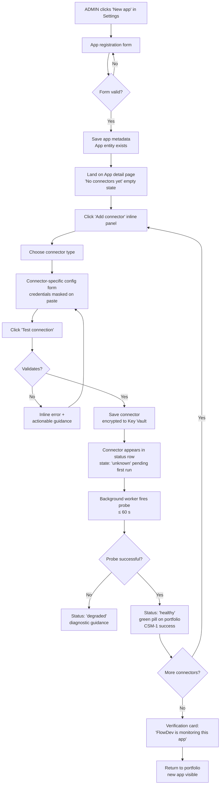
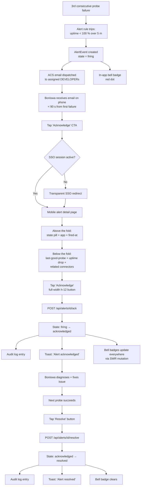

---
stepsCompleted:
  - step-01-init
  - step-02-discovery
  - step-03-core-experience
  - step-04-emotional-response
  - step-05-inspiration
  - step-06-design-system
  - step-07-defining-experience
  - step-08-visual-foundation
  - step-09-design-directions
  - step-10-user-journeys
  - step-11-component-strategy
  - step-12-ux-patterns
  - step-13-responsive-accessibility
  - step-14-complete
lastStep: 14
uxDesignStatus: complete
uxDesignCompletedAt: '2026-04-28'
inputDocuments:
  - _bmad-output/planning-artifacts/PRD.md
  - _bmad-output/planning-artifacts/product-brief.md
  - _bmad-output/planning-artifacts/style-guide.md
  - _bmad-output/planning-artifacts/tech-stack.md
workflowType: 'ux-design'
project_name: 'FlowDev'
user_name: 'Don'
date: '2026-04-28'
styleGuidePolicy: 'extend, do not redefine — FlowDesk style guide is authoritative canonical reference'
focusAreas:
  - dashboard tiers (PRD §5.10 — portfolio, app detail, cross-cutting v1.1)
  - FlowDev-specific UI patterns (app health pill, sparkline cells, connector status row, time-range selector, ZAR cost display)
  - connector onboarding flow (PRD §14.8 — explicit-config v1, auto-discovery v1.1+)
  - alert lifecycle UX (firing → acknowledged → resolved)
---

# UX Design Specification — FlowDev

**Author:** Don
**Date:** 2026-04-28
**Codename:** MPAMOT (Multi-Platform Application Monitoring & Operations Tool)
**Source Inputs:** `PRD.md` (primary), `product-brief.md`, `style-guide.md` (canonical FlowDesk reference — extend, do not redefine), `tech-stack.md`

---

## UX Scope (per PM direction)

This UX design intentionally focuses on four areas, not the full surface:

1. **The three dashboard tiers** — Portfolio (landing), App Detail (2/3 + 1/3), Cross-cutting v1.1 — per PRD §5.10 and §FR46–FR49.
2. **FlowDev-specific UI patterns extending the FlowDesk style guide** — app health pill, sparkline cells, connector status row, time-range selector, ZAR cost display.
3. **Connector onboarding flow** — Journey 3 (Rashied) realised in concrete screens. Explicit configuration in v1 per PRD §14.8.
4. **Alert lifecycle UX** — Journey 4 (Boniswa) realised: notification → ack → resolve, on desktop and mobile.

Other UI surfaces (Reports CSV export, Audit Log search, User & Role management) inherit existing FlowDesk patterns wholesale and require no FlowDev-specific UX work.

## Style Guide Policy

The FlowDesk style guide (`style-guide.md`) is **authoritative and canonical**. This document **extends** it for FlowDev-specific patterns; it never **redefines** existing tokens, layout primitives, or interaction conventions.

Where this document specifies a new pattern, the spec is:
1. Anchored to a Tailwind / shadcn / Radix primitive already documented in the style guide.
2. Composed from existing brand tokens (`--brand`, `--ring`, `--muted-foreground`, semantic status colours from style guide §2).
3. Tested in both light and dark themes per style guide §13.

If a tension surfaces between an extension proposed here and the canonical guide, the canonical guide wins and the extension is reworked.

<!-- Detailed UX content will be appended sequentially through collaborative workflow steps -->

---

## Executive Summary

### Project Vision (UX angle)

FlowDev's UX delivers the **four-question answer** — *is app X up · what does it cost · who used it · is its data growing* — across the MPAMOT portfolio in a single internal console. The interface inherits FlowDesk's familiar shell (sidebar + header + content layout, brand purple, Inter, en-ZA / ZAR formatting); the FlowDev-specific job is to make portfolio-level state legible at a glance. The differentiator at the UX layer is **information density without visual noise**: 50 apps × 4 live signals must not become a wall of colour.

### Target Users

The three roles consume FlowDev differently. UX optimises per role, not generically.

| Role | Persona(s) | Primary surface | Frequency | Device bias | UX priority |
|---|---|---|---|---|---|
| **ADMIN** | Rashied | `/admin/settings` (Apps, Connectors, Credentials, Alert Rules, Audit, System tabs) | 2–5 sessions/week | Desktop | Form-heavy: validation, error recovery, sensitive-value handling, audit-log readability |
| **MANAGER** | Dewald, Werner | `/portfolio`, `/costs`, `/adoption`, `/reports` | Daily | Desktop | Read-and-export: sortable tables, time-range slicing, instant answer to ad-hoc questions, one-click report generation |
| **DEVELOPER** | Thandi, Boniswa | `/portfolio` (morning glance), App detail, `/alerts` (when paged) | Daily + ad-hoc when on call | Desktop *and* mobile | Glance-and-act: portfolio scannability, mobile ack flow for alerts, scoped views for assigned apps only |
| **VIEWER** *(v2)* | — | `/portfolio` read-only digest | — | — | Out of v1 scope; design must not preclude |

### Key Design Challenges

Scoped to the four PM-specified focus areas:

**1. Density without overwhelm at the portfolio tier.** Every app row/tile surfaces ≥ 4 signals (health pill, sparkline, today's spend, today's logins, alert count). At 50 apps the portfolio must remain scannable, not become a fairground. Information hierarchy (typography weight, colour discipline, sparkline restraint) carries the legibility weight; layout primitives are inherited from style guide §7 (Tables, Cards, Stat Cards) without redefinition.

**2. Extending the style guide without breaking its calm.** The five FlowDev-specific patterns (app health pill, sparkline cells, connector status row, time-range selector, ZAR cost display) must compose with FlowDesk's existing tokens and primitives (`bg-brand`, semantic status colours from §2, shadcn Badge/Card/Table primitives) — not introduce competing visual systems. Dark-mode parity is non-negotiable from day one (NFR-B2, style guide §13).

**3. Connector onboarding feels like a guided flow, not a stack of forms.** Journey 3 has six setup actions (register app → attach HTTP probe → attach Azure ARM → attach Azure Cost Mgmt → attach PG metrics → attach webhook + copy URL). The UX must turn that into a structured progression with credible progress indication, sensitive-value handling (paste-and-mask credentials, validate-before-save, never echo on save), a post-setup connectivity report, and graceful accommodation of either §14.6 provisioning model — without inventing a wizard pattern that contradicts FlowDesk's normally-direct shadcn forms.

**4. Mobile alert ack flow.** Boniswa opens an ACS email on her phone in a meeting. From email link to acknowledged alert must be **one tap on a portrait viewport** — no horizontal scroll, no zooming, no second screen. The notification bell from style guide §6 currently handles read/unread; FlowDev needs to layer in alert-state semantics (firing/acknowledged/resolved) without rewriting the pattern. State must be visible *everywhere* an alert is referenced.

### Design Opportunities

Where deliberate UX creates leverage beyond what the FlowDesk inheritance gives us for free:

1. **Sparkline-as-glance.** Replace every "what's trending" question with a 24-px Recharts micro-chart in tables. Thandi's morning glance compresses to ~5 seconds because trends are visible without click-through. Performance discipline required at 50+ rows.

2. **Time-range selector as a single shared primitive.** One shadcn-based component (presets `24h / 7d / 30d / 90d / custom`), used identically across portfolio, app detail, costs, adoption, reports. Builds workflow muscle memory across the product. No per-page reinvention.

3. **Connector status row as the post-onboarding confidence-builder.** Right after Rashied finishes Journey 3, the most prominent thing on the App detail page should be a row of "✓ HTTP Probe — first run 47s ago, 200 OK" status lines. Closes the configuration loop visibly, builds trust.

4. **Alert detail page mirrors email template.** The ACS email Boniswa receives can carry the same visual structure (alert pill, app name, fired-at, last-uptime-snapshot, primary CTA) as the in-app detail page she taps through to. Click-through feels seamless; her ack action is muscle memory by week two.

5. **`<CostDisplay>` component, three variants from one helper.** `formatZAR()` plus a typed component handles (a) table cell *"R 4,250"*, (b) stat card *"R 4,250 / mo · USD 230 forecast"*, (c) detail-page primary *"R 4,250 forecasted | source USD 230 @ SARB R18.48 of 2026-04-25"*. No per-page reinvention; FX disclosure standardised.

---

## Core User Experience

### Defining Experience

**The Morning Glance is the load-bearing interaction.** The single most frequent action across all roles is opening `/portfolio` and reading the room — health pill, today's spend, today's logins, alert count — for every app within scope (Journey 1). If this interaction is excellent, FlowDev wins; if it is mediocre, every other capability (cost intelligence, alerting, reporting) fails to land because operators don't develop the habit of starting their day in the tool.

A secondary failure-mode-defining loop is **alert ack-and-resolve** when a DEVELOPER is paged (Journey 4). Frequency is low, criticality is total — if a phone-based ack is broken, FlowDev's proactive-alerting promise breaks.

Every other surface (Reports, Audit, Settings) supports these two loops. Everything else is in service of these two.

### Platform Strategy

**Web only.** No native mobile, no desktop, no PWA installation in v1 (re-evaluate at 60-day gate if mobile-frequent operators emerge).

| Concern | Decision |
|---|---|
| Form factor | Browser, mobile-responsive (mobile-first build), `md:` breakpoint primary per FlowDesk style guide §9 |
| Input modality | Mouse/keyboard primary on desktop; touch on mobile for the alert ack flow specifically |
| Gestures | Standard taps and scrolls only — no multi-touch, no swipe-to-action |
| Offline | Not supported. FlowDev requires connectivity (it *is* a connectivity dashboard) |
| Theme preference | System-mediated dark/light at parity, with explicit toggle from FlowDesk shell |
| Browser-API leverage | None platform-specific. No Web Push, no Notifications API in v1 — alerts go via email + in-app bell |
| Min viewport | 320 px portrait (Boniswa's phone) for the alert ack flow only; portfolio dashboard targets `md:` (768 px) and above |

### Effortless Interactions

Mapped to the four PM-specified focus areas:

| Focus area | Should feel effortless |
|---|---|
| **Dashboard tiers** | Reading the portfolio answers all four questions per app **with zero clicks**. Health pill → Q1 ("up?"); sparkline → Q1.5 ("trending?"); cost cell → Q2 ("cost?"); logins cell → Q3 ("used?"); resource-snapshot indicator → Q4 ("growing?"). All in one row, no horizontal scroll for ≤ 50 apps. |
| **Dashboard tiers** | Time-range slicing is a single component press + coordinated chart re-render across the page. No nav, no modal, no "apply" step. |
| **Connector onboarding** | Adding a connector to an app during onboarding feels like filling a section of one form, not navigating to a separate page. The connector list updates in place. |
| **Connector onboarding** | Pasting a credential masks immediately on paste, validates before save (`Test connection` button), and never surfaces the value after save (audit-log access only). |
| **Alert lifecycle UX** | Acknowledging an alert from email is one tap on phone — link → ack-button visible above the fold → confirmation toast → done. Session already active via SSO; no separate login. |
| **FlowDev UI patterns** | Health pill, ZAR cost display, time-range selector are **the same component everywhere they appear**. No per-page reinvention. |

### Critical Success Moments

The moments where FlowDev is judged to be working — or not:

| # | Moment | Persona / Journey | Failure consequence |
|---|---|---|---|
| **CSM-1** | **First successful probe.** When Rashied saves the HTTP probe during onboarding (Journey 3), a green pill must appear on `/portfolio` within 60 seconds with no manual refresh. | Rashied / J3 | If this fails, the connector pattern feels broken on day one. |
| **CSM-2** | **First proactive alert.** First time the uptime threshold trips and Boniswa receives both ACS email + in-app bell within 90 seconds of the third failed probe. Mobile alert detail page must be visually identical to the desktop one. | Boniswa / J4 | If this fails, the brief §3 goal #3 ("alerted before user complains") is not delivered. |
| **CSM-3** | **First monthly portfolio report.** Werner's first month-end run completes in < 60s and produces a CSV that opens cleanly in Excel with ZAR + USD parallel columns. | Werner / J5 | If this fails, the tool fails to justify itself to leadership at the natural review cadence. |
| **CSM-4** | **First cost spike investigation.** Dewald sorts the portfolio cost table by month-over-month delta, drills into the spiking app, sees the DB-storage chart, finds the spike date — all in < 30 minutes. | Dewald / J2 | If this fails, "FinOps without CloudHealth" claim collapses. |
| **CSM-5** | **The closed tab moment.** Week 2: an operator realises they haven't opened Azure Portal or the DO console for their primary apps. | All operator roles | Soft signal, but the validated-learning gate — and the truest indicator FlowDev replaced what it set out to replace. |

### Experience Principles

These guide every UX decision. When a design choice is contested, the design aligned with these principles wins.

1. **Glance before click.** Every screen makes the operator's primary question answerable without interaction. Drill-downs are for *deeper* answers, never the first answer.
2. **One pattern, every page.** The five FlowDev-specific patterns (health pill, sparkline cell, connector status row, time-range selector, ZAR display) appear identically wherever they appear. Build muscle memory across pages, not novelty.
3. **Extend the inheritance, don't fight it.** FlowDesk's style guide is the substrate. New FlowDev patterns compose with existing primitives (`bg-brand`, semantic status colours, shadcn Badge / Card / Table); they never redefine or compete with them. If a tension surfaces, the canonical guide wins.
4. **State is visible everywhere.** Alert state, connector state, app health state — surfaced *wherever* the entity is referenced. No "you have to click in to see if it's broken." This is the operational substrate of the four-question answer.
5. **Mobile is a working surface, not a fallback.** Journey 4 (alert ack from phone) is a v1 production scenario, not a courtesy. Any interaction that fails on a portrait 360 px viewport for an on-call DEVELOPER is broken in v1.

---

## Desired Emotional Response

FlowDev is internal ops tooling, not a consumer product. The relevant emotional axis is not *delight / excitement / surprise* — it is **confidence, calm, and competence**. Designing for the wrong emotion (cheerful, animated, gamified) actively damages the product.

### Primary Emotional Goals

Five emotions are load-bearing. The UX engineers for these specifically.

| # | Emotion | What it means in operator language | What kills it |
|---|---|---|---|
| **1** | **Confidence in the data** | *"I trust what this tool tells me."* The number on screen has provenance, freshness, and a way to verify. | Stale data without disclosure. Numbers without timestamps. Currency without FX source. |
| **2** | **Calm at the portfolio tier** | *"Reading the portfolio is not an emergency-room visit."* Green is the resting state. Most apps green most of the time. The eye rests on green and attends only to non-green. | Animations on healthy state. Saturated colour. Badges-of-shame. Visual noise rewarding "look at me." |
| **3** | **Vindication when caught** | *"I got ahead of this. I caught it before the user did."* The proactive-alert moment (J4) and the cost-spike-caught moment (J2). | Alerts that arrive after user complaints. Cost data that confirms what the bill already showed. |
| **4** | **Relief from console-juggling** | *"I'm not flipping between Azure portal, DO, and the bills any more."* The leading indicator: tabs closed during the workday. | Critical answers still requiring a cloud-console click-through. |
| **5** | **Competence in front of leadership** | *"The report I sent looks professional, not improvised."* Werner's CSV opens clean in Excel; ZAR + USD parallel columns; portfolio totals don't need post-processing. | Reports that need spreadsheet surgery before sending. Currency rounding errors. Inconsistent date formats. |

### Emotional Journey Mapping

| Stage | Emotion target | What enables it |
|---|---|---|
| **First session (discovery)** | Familiarity → satisfaction | The FlowDesk shell is unmistakable from second one — same sidebar, same brand purple, same Inter type. Operators don't have to learn a new tool, they extend an existing one. |
| **First successful probe (CSM-1)** | Anticipation → confidence | Within 60 seconds of saving the HTTP probe, a green pill appears on `/portfolio` without manual refresh. Closes the configuration loop visibly. |
| **Daily morning glance (J1)** | Calm scan → focused attention only where needed | Most apps green; the eye goes to non-green. No attention tax on the healthy majority. Sub-2s load (NFR-P1) means no waiting before scanning. |
| **Cost investigation (J2)** | Determination → narrowing → "found it" | Sortable month-over-month delta column → drill-in → time-range slice → root cause located. Each step's response feels instant. |
| **Onboarding new app (J3)** | Methodical progression → sense of completion | Stepwise structure with credible progress; each connector's first-run success is visible; the post-onboarding view shows "✓ FlowDev is monitoring this app." |
| **Alert ack on phone (J4, CSM-2)** | Alertness (not panic) → orientation → confident action | Email and in-app alert detail share a layout. Alert pill, app name, fired-at, last-good-probe, ack button — visible above the fold on a portrait viewport. One tap. Confirmation toast. Done. |
| **Monthly report (J5, CSM-3)** | Procedural calm → competence at delivery | Date range + report type + Generate. CSV downloads in < 60s. Excel-ready. Werner sends without surgery. |
| **Failure mode (connector or data fault)** | Diagnostic clarity (NOT blame or panic) | Failed connector shows *why* and *what to do* (e.g. "Credential expired 2 days ago — rotate via Settings"). Never just a red badge with no path forward. |
| **Returning daily (week 2+)** | Muscle memory → embedded habit | Time-range component is identical wherever it appears. Cost-display component is identical wherever it appears. Familiarity becomes velocity. |

### Micro-Emotions

The fine-grain contrasts that make or break operational software:

| Want | Avoid | Mechanism |
|---|---|---|
| **Confidence** | Confusion | Every state has colour + text label. The health pill never relies on colour alone (NFR-A4). |
| **Trust** | Skepticism | Every number carries provenance — timestamp, source, FX rate, freshness disclosure. The forecast literally says "based on N complete days of data, refreshed M minutes ago." |
| **Calm** | Anxiety | Green is the resting state, not the celebrated state. No animation on healthy. Whitespace > density when in tension. |
| **Accomplishment** | Frustration | Onboarding has discrete, visible success signals at each connector. The first probe firing is the climax — it's visible. |
| **Vindication** | Helplessness | Alerts arrive with context (uptime drop %, time since firing, recent changes), not just "something's wrong." |
| **Continuity** | Disruption | FlowDesk shell + tokens are inherited wholesale. No cognitive context-switch when entering FlowDev from the FlowDesk family. |

### Design Implications (emotion → UX choice)

| Emotion target | UX consequence |
|---|---|
| **Confidence in data** | Freshness-disclosure component on every cost / forecast value (CSM-3 reinforced); timestamp on every chart legend; "Last updated N min ago" footer on portfolio. |
| **Calm at portfolio** | Colour discipline: green is muted-default (not victory-green); red is sparingly used and accompanied by text. No animations beyond style guide §13's transitions. Sparklines without axes — restraint. |
| **Vindication on alert** | Alert detail page surfaces *context* before action: last good probe, % uptime drop over 5 / 15 / 60 min, status of related connectors. The ack button is primary CTA but the user has data to feel sure. |
| **Relief from juggling** | Onboarding's verification view explicitly says: *"FlowDev is now monitoring this app — uptime, cost, adoption, email."* A line of plain text that names what's covered. Then a link to the new App detail page so the operator's habit is *to come here*, not a console. |
| **Competence on report delivery** | CSV column order designed for Excel; ZAR primary + USD source in adjacent column with FX rate header; portfolio totals row included; date range echoed in the filename. |

### Emotional Design Principles

These supplement the experience principles from §Core User Experience — those are about *what works*; these are about *what feels right*.

1. **Green is the resting state, not the celebrated state.** Healthy is normal. Don't reward green with animation, gradient, or victory tones. Let it be quiet.
2. **Every number has provenance.** Confidence = trust = paper trail. Source, timestamp, FX rate, freshness — always present, never hidden behind tooltip-only disclosure.
3. **State is unambiguous.** Colour + text label everywhere. No "is that yellow good or bad?" anywhere.
4. **The portfolio is calm — until it isn't.** Quiet by default. When something does go wrong, surface it deliberately and clearly — not by saturating the screen with red.
5. **Diagnose, don't blame.** Failure states (connector failed, alert firing, credential expired) come with *why* and *what to do*, never just a red badge.
6. **Inherit the inheritance's emotional tone.** FlowDesk feels professional and quiet. FlowDev maintains that — the new patterns extend the calm; they never compete for attention.

---

## UX Pattern Analysis & Inspiration

The dominant inspiration source is non-negotiable: **FlowDesk itself**. Stack and style inheritance is mandatory (brief §8 / §9), so most patterns are donated. This section names what is inherited, the few external references for FlowDev-specific extensions, and the anti-patterns to actively reject.

### Inspiring Products Analysis

The hierarchy is deliberate: FlowDesk is authoritative; external references only inform extensions.

#### 1. FlowDesk (sister product) — *the inheritance, not inspiration*

- **What is taken:** the entire app shell (`w-64` sidebar + `h-16` header + `p-4 md:p-6 space-y-6` content), the brand purple (`#700ce9`), Inter font, en-ZA / ZAR formatting, dark-mode toggle, Auth.js v5 SSO pattern, all shadcn/ui primitives at canonical configuration, the notification bell pattern (style guide §6), the Detail-Page (2/3 + 1/3) split (style guide §8).
- **What it does well that matters:** calm, professional, low-noise. Forms with clear validation. Tables with sortable headers and pagination. No animation theatre on healthy state.
- **Why this is foundational:** operators are already FlowDesk users — cognitive context-switch is zero.

#### 2. Linear — *calm professional density*

- **What it does well:** information density without visual noise. Status pills that feel definitive. Sparing colour — accent on action, never on rest. Subtle animation only on state-change. Keyboard-first navigation that doesn't punish mouse users.
- **What FlowDev borrows:** the discipline. Linear is the gold standard for "an operator can scan dozens of items at a glance without anxiety." The portfolio dashboard targets the same emotional outcome.

#### 3. Vercel dashboard — *project tile pattern*

- **What it does well:** a grid of tiles each surfacing name + current state + a couple of micro-signals. Inline sparkline charts inside cards without axes. Drill-in to a project detail page that feels like an extension of the same view.
- **What FlowDev borrows:** the portfolio tile concept (app name + health pill + today's signals + alert count) and the inline-sparkline-without-axes treatment. Extended to a denser table-row variant since 50 apps don't fit a tile grid as comfortably as Vercel's typical project count.

#### 4. PagerDuty / Grafana OnCall — *alert lifecycle, mobile-first*

- **What they do well:** alert detail page surfaces *context* (what's wrong, since when, what services depend on this) before the *action* (acknowledge, resolve, escalate). Mobile-friendly enough that on-call engineers ack from phones without friction. Status visible at every reference.
- **What FlowDev borrows:** context-first alert detail layout (J4). Mobile-portrait-first design for the ack flow. The discipline that alert state is visible *everywhere* the alert appears.

#### 5. Stripe dashboard — *currency display with provenance*

- **What it does well:** primary value with secondary source disclosure inline. Multi-currency handling that always tells you the rate and the timestamp when foreign-currency conversion is involved. Never a number in isolation.
- **What FlowDev borrows:** the `<CostDisplay>` component pattern — primary ZAR value + USD source + FX rate + freshness, composed gracefully across density levels.

### Transferable UX Patterns

| Pattern | Source | FlowDev application |
|---|---|---|
| Status pill = colour + symbol + label | Linear, FlowDesk style guide §2 | App health pill (`UP / DEGRADED / DOWN / UNKNOWN`); alert state pill (`firing / acknowledged / resolved`); connector status pill (`healthy / degraded / failing / disabled / unknown`). NFR-A4 mandates colour + label. |
| Sparing animation, on state change only | Linear | Animate row entry on first portfolio render; animate state-change on health pills. No decorative motion on healthy state. |
| Sparkline-in-table-row, no axes | Vercel | Sparkline cells in the portfolio table — Recharts `<LineChart>` at 24px height, axes hidden, single accent colour per row. |
| Project-tile grid as overview | Vercel | Optional tile-view variant for low-app-count operators (≤ 12 apps); table-row default for higher density. |
| Context-first alert detail | PagerDuty | Alert detail surfaces last-good-probe + uptime-drop% + related connector status before showing the ack button. |
| Mobile-portrait alert ack flow | PagerDuty | Email link → page with alert pill above the fold → primary ack button without scroll → confirmation toast → done. CSM-2. |
| Currency with provenance inline | Stripe | `<CostDisplay>` component variants (table / card / primary) with FX rate, source, and freshness disclosed at appropriate density. |
| Detail-page (2/3 + 1/3) split | FlowDesk style guide §8 | App detail page — main charts in 2/3 column, recent-alerts + connector-status sidebar in 1/3 column. |
| Time-range selector as shared primitive | FlowDesk pattern (extended) | One component used identically across portfolio, app detail, costs, adoption, reports. Presets `24h / 7d / 30d / 90d / custom`. |
| Notification bell with state badge | FlowDesk style guide §6 (extended) | Existing read/unread pattern + new alert-state badge (red dot for firing alerts within scope). |

### Anti-Patterns to Avoid

| Anti-pattern | Source | Why FlowDev rejects it |
|---|---|---|
| Datadog-style "everything is dense" | Datadog | **Explicitly rejected by PM.** Datadog overwhelms across every surface. FlowDev is dense at the portfolio tier *only*; app-detail, cost, and investigation pages use whitespace generously to support focused decision-making. |
| CloudHealth enterprise complexity | CloudHealth | Multi-step modal wizards for simple operations. FlowDev's scope is small enough that everything fits on-page. |
| Generic "admin template" aesthetic | Bootstrap admin templates, AdminLTE | The sidebar-and-30-widgets look. FlowDesk has earned its calm; FlowDev preserves it. |
| Toast spam on healthy state | Some monitoring tools | We don't celebrate green. No "✓ Probe successful" toast on healthy probes. Healthy is reflected in pills and silence. |
| Modal-driven configuration | Generic SaaS dashboards | Adding a connector should not open a modal overlaying the page. Inline panel within the App detail page with in-place validation feedback. |
| Colour-only state indicators | Many dashboards | NFR-A4 requirement: colour + text label everywhere. No "is yellow good or bad?" anywhere. |
| Animation on healthy state | Pulse effects on green | Calm is the resting state. Animation reserved for state transitions and loading. |
| Number without provenance | Many cost dashboards | A ZAR value without the FX rate, source, and timestamp is untrustworthy. Always show the paper trail. |
| Drill-in modals for detail | Some dashboards | Modal popovers for app detail. Use real routes (`/apps/[id]`) — bookmarkable, shareable, browser-history-sound. |

### Design Inspiration Strategy

**What to adopt directly:**
- FlowDesk's complete shell, tokens, and primitives (mandatory inheritance).
- Linear's colour discipline and animation restraint — green is the resting state, accent only on attention-required.
- PagerDuty's context-before-action alert detail layout.
- Stripe's inline-with-provenance currency display pattern.

**What to adapt:**
- Vercel's project-tile pattern → table-row-with-sparkline default, with tile-view as a secondary mode for low-app-count operators.
- PagerDuty's mobile ack flow → tuned to one-tap-from-email with no separate login (SSO session already active).
- Linear's status pill → extended to four state vocabularies (app health / alert lifecycle / connector status / probe state) sharing the same visual grammar.
- FlowDesk's notification bell → extended with alert-state semantics (firing-alert badge alongside read/unread).

**What to avoid actively:**
- Datadog density everywhere (PM-confirmed rejection).
- Modal-driven onboarding (Journey 3 is page-based with in-place connector addition).
- Toast spam, animation theatre, generic admin-template aesthetics, colour-only state, numbers without provenance, drill-in modals.

### PM-confirmed visual preferences

Stated by Don during this design step (2026-04-28); these resolve close-call design choices going forward:

- **Charts and visuals are positively wanted** — Recharts is in-stack; use it confidently. A chart that summarises a trend is preferred over a wall of numbers.
- **Insightful and understandable info is the goal** — not raw data dumps. The job of a chart or table is to make the answer visible.
- **Anti-clutter is the operating principle** — density is fine on the portfolio scan tier; everywhere else, whitespace > density when in tension.
- **Assertive colour on alert surfaces is welcome** — firing red / acknowledged amber / resolved muted is endorsed (still paired with text labels per NFR-A4).
- **Datadog density is explicitly rejected** — across every surface that is *not* the portfolio dashboard.

This strategy lets FlowDev land within an hour of opening for any FlowDesk user — extending the family without introducing a new dialect.

---

## Design System Foundation

### Design System Choice

**shadcn/ui on Radix UI primitives, Tailwind CSS 4, Recharts, Lucide React, Inter** — inherited wholesale from FlowDesk, not selected freshly.

This is a **themeable system**: customisable foundation with proven components, balancing speed against brand specificity. The system already accommodates FlowDesk's brand identity; FlowDev extends without redefining.

| Layer | Technology | Source |
|---|---|---|
| Component library | shadcn/ui (CLI v3.8.5+) | FlowDesk inheritance (tech-stack §5) |
| Headless primitives | Radix UI 1.4.3 | FlowDesk inheritance |
| Styling | Tailwind CSS 4 + `tailwindcss-animate` + `tw-animate-css` | FlowDesk inheritance |
| Icons | Lucide React 0.576.0 | FlowDesk inheritance |
| Type | Inter (Google Fonts via Next.js font optimisation) | FlowDesk style guide §3 |
| Charts | Recharts 2.15.4 | FlowDesk inheritance (PRD §5.10 mandate) |
| Class merging | `cn()` helper = `clsx` + `tailwind-merge` | FlowDesk style guide §1 |
| Variants | `class-variance-authority` (CVA) | FlowDesk inheritance |
| Forms | React Hook Form + Zod via `@hookform/resolvers` | FlowDesk inheritance |
| Date | date-fns + react-day-picker, en-ZA locale | FlowDesk inheritance |

### Rationale for Selection

The choice is constrained, not selected. Reinforcements:

1. **Mandate.** Brief §8.1 makes stack inheritance mandatory; deviations require explicit approval. Style guide §1 specifies the same component library and configuration.
2. **Zero cognitive context-switch.** Operators using FlowDev are already FlowDesk users; spending discretionary attention on a different design system would damage adoption — the opposite of the "Continuity > Disruption" emotional principle.
3. **shadcn's copy-into-project model is a feature here.** Components live in `src/components/ui/` rather than being imported from a package — full FlowDev-side customisation without forking. The FlowDev-specific extensions install alongside the inherited components.
4. **Accessibility comes built-in.** Radix primitives ship keyboard navigation, focus management, and ARIA attributes — directly supports NFR-A1 (WCAG 2.1 AA) without bespoke a11y engineering.
5. **No new chart-library decision.** Recharts is in-stack and already configured. Per PM-confirmed preference for charts, this is a feature — Recharts handles sparkline cells, full-size trend charts on app detail, portfolio cost trends, and report visualisations from one library.

### Implementation Approach

**Repo and codebase boundary** *(per PRD)*:
- FlowDev lives in a separate repository (`MPAMOT`); design tokens (Tailwind brand palette, Inter font, shadcn config) are re-implemented from the style guide, not vendored from FlowDesk.
- shadcn CLI used to generate component scaffolds at canonical configurations from style guide §1: `style: default`, `rsc: true`, `tsx: true`, `baseColor: neutral`, `cssVariables: true`.
- `tailwind.config.ts` carries the brand palette extensions from style guide §2 (`brand-50` through `brand-950`, with `brand` aliased to `brand-600` = `#700ce9`).
- `globals.css` carries the CSS variable token system from style guide §2 (light + dark variants).

**Theme parity from day one** (NFR-B2):
- Both light and dark themes built and visually validated as part of any pattern's definition. The `.dark` class toggle on `<html>` is the single source of truth.
- All FlowDev-specific extensions specified with their dark-mode treatment alongside their light-mode treatment in the same component file.

**Locale and formatting** (NFR-B3):
- HTML `lang="en-ZA"`.
- Dates via date-fns at locale `en-ZA`, format `dd MMM yyyy` per style guide §12.
- Currency via shared `formatZAR()` helper, ZAR primary, USD source disclosure per FlowDev `<CostDisplay>` pattern.

**Component organisation:**
- shadcn/ui primitives at `src/components/ui/`.
- FlowDev-specific extensions at `src/components/flowdev/` (e.g. `app-health-pill.tsx`, `sparkline-cell.tsx`, `connector-status-row.tsx`, `time-range-selector.tsx`, `cost-display.tsx`).
- Compositional components (page-level layouts) under `src/components/portfolio/`, `src/components/app-detail/`, etc.

### Customisation Strategy

**Extend, never redefine.** FlowDev adds five PM-specified extensions plus targeted extensions to two existing FlowDesk patterns. Nothing is replaced.

#### New FlowDev extensions

| Extension | Built from | Specifies |
|---|---|---|
| **`<AppHealthPill>`** | `<Badge>` primitive + semantic status tokens (style guide §2) | Four variants: `UP` (muted green, resting state), `DEGRADED` (amber), `DOWN` (red, only when truly down), `UNKNOWN` (slate). Always colour + text label. Compact size used inline next to app names; default size in headers. |
| **`<SparklineCell>`** | Recharts `<LineChart>` + accent colour tokens | 24 px height, axes hidden, single line, single accent colour per row, no gridlines. Optimised for table-row density (50+ rows on portfolio). Variant for tile view at slightly larger height. |
| **`<ConnectorStatusRow>`** | `<Badge>` + relative-time text + `<DropdownMenu>` | Single-line list-row pattern: connector name + last-successful-run timestamp + status pill + action menu. Used on App detail page. |
| **`<TimeRangeSelector>`** | `<Tabs>` (or `<DropdownMenu>` for compact mode) + custom-range `<Popover>` with date picker | Presets: `24h / 7d / 30d / 90d / custom`. Single shared component used identically across portfolio, app detail, costs, adoption, reports. Coordinates with chart re-fetch via SWR. |
| **`<CostDisplay>`** | Typography tokens + `formatZAR()` helper | Three density variants: `inline` (table cell, "R 4,250"), `card` (stat card, "R 4,250 / mo · USD 230"), `primary` (detail page, full provenance: "R 4,250 forecast · source USD 230 @ SARB R18.48 of 2026-04-25"). FX disclosure standardised. |

#### Extensions to existing FlowDesk patterns

| Existing pattern | FlowDev extension | Why minimal |
|---|---|---|
| Notification bell (style guide §6) | Adds firing-alert state badge (red dot) alongside the existing read/unread indicator. The Popover content gains an "Active alerts" section above the existing notification list. | Maintains muscle memory — bell still does what FlowDesk users expect, with one additional signal. |
| Sidebar nav (style guide §5) | FlowDev nav items (Portfolio, Apps, Costs, Adoption, Alerts, Reports, Settings, Help) installed at the existing pattern. Icons from Lucide React. | Pure parameter change; no new pattern. |
| Detail Page split (style guide §8) | Used verbatim for App detail page — main charts in 2/3 column, recent-alerts + connector-status sidebar in 1/3. | Inherited as-is. |

#### Explicitly *not* added

- **No custom design system.** Brief §8.3 explicit: "Use shadcn/ui as-is."
- **No new colour system.** The brand palette + semantic status tokens cover all FlowDev needs.
- **No new font, no new typography scale.** Inter + the type scale from style guide §3.
- **No new spacing tokens** beyond style guide §11.
- **No new icon library.** Lucide React; choose appropriate icons from the existing set.

The result: a FlowDesk user landing on FlowDev encounters perhaps a dozen new components — but recognises every primitive underneath them. Within an hour the new components feel native because they were built from the same tokens.

---

## The Defining Interaction

This section drills into the single interaction that defines FlowDev. The §Core User Experience above frames experience principles broadly; this section drills into the specific moment that, if nailed, makes the rest follow.

### The Defining Experience: The Portfolio Glance

**The single interaction that makes FlowDev FlowDev:** opening `/portfolio`, reading the entire MPAMOT portfolio's state in under 30 seconds, deciding whether anything needs attention, and either drilling in or exiting without effort.

This is the interaction operators describe to colleagues: *"I open one tab and I can see everything."* It is the moment where FlowDev replaces a stack of cloud-console tabs.

**Why this is THE defining experience and not the others:**

| Interaction | Frequency | Importance | Defining? |
|---|---|---|---|
| **The Portfolio Glance (J1)** | Daily, often multiple times | Critical to habit formation | ✅ **Yes** |
| Cost Spike Investigation (J2) | Ad-hoc, weekly-ish | High when triggered | Supporting |
| Onboarding new app (J3) | Once per app | Critical at point-of-use | Supporting |
| Alert ack on phone (J4) | When paged | Failure-mode-defining | Supporting |
| Monthly portfolio report (J5) | Monthly | Important to leadership | Supporting |

If the Glance is excellent → operators visit daily → habit forms → cost / alerts / reports get used because users are already in the tool. If the Glance is mediocre → no habit → other capabilities go unused regardless of quality. **It is the load-bearing interaction.**

### User Mental Model

Operators bring the **"checking on things"** mental model — analogous to skimming an inbox, scanning a status page, or doing morning rounds. They expect:

- **The most important information first** (anything wrong jumps out).
- **A visible default of "everything's fine"** when it is fine — not silence, but legible green.
- **Predictable structure** — apps in the same place every day; layout stable.
- **A clean way to drill into something noteworthy** without losing context.
- **A clean way back** to the overview from a detail view.

**What kills this mental model:**
- *Surprise.* Layout that changes day-to-day.
- *Ambiguity.* Colour without label; status without context.
- *Cost.* Waiting for the page to load before scanning.
- *Distraction.* Peripheral content the operator didn't ask for.
- *Doubt.* A number without a timestamp or source — "is this current?"

**What current (non-FlowDev) solutions teach about the model:**

| Current behaviour | What it reveals about expectations |
|---|---|
| Operators keep 4+ cloud console tabs open simultaneously | They want one place that aggregates the answer |
| Daily standup surfaces issues from yesterday's overnight events | They expect the dashboard to *be* the standup data |
| Spreadsheets stitched manually for cost reviews | They want sortable, comparable data, not screenshots |
| Reactive incident response (find out from users) | They expect proactive alerting via the dashboard |

What they hate about today's status quo: the cognitive overhead of stitching the picture from multiple sources.
What they will love when FlowDev works: a single dashboard that just knows.

### Success Criteria (specific to the Glance)

The interaction is a success when each of these is observably true:

1. **All four questions are answerable per app without click-through.** Health (Q1) via pill. Trending (Q1.5) via sparkline. Cost (Q2) via inline ZAR cell. Logins (Q3) via inline count. Growing (Q4) via daily-snapshot indicator. No row's primary information is hidden in a tooltip.
2. **50 apps fit on a typical desktop viewport (1440 × 900) without horizontal scroll.** Vertical scroll allowed but minimised; pagination kicks in beyond v1's 50-app target.
3. **Sub-2s warm-cache load (NFR-P1).** First paint shows the shell + skeleton; rows resolve in < 2s.
4. **Sortable by any column.** Click header to toggle asc/desc. Sort preference is sticky per operator session.
5. **Filterable by platform, owner, and lifecycle status.** Filter pills above the table.
6. **The eye rests on green; only non-green draws attention** (PM-confirmed colour discipline). Healthy is muted, not victorious.
7. **Every state pill carries colour + text label** (NFR-A4).
8. **Time-range affects sparklines synchronously** — single press, all rows update without a flash of incorrect data.
9. **Drill-in preserves scroll position on return.** Click row → `/apps/[id]` → browser back → return to same scroll position with same filters/sort.

### Novel vs. Established Patterns

**The Glance is mostly established patterns combined deliberately**, not novel interaction design. This is the right answer — operators don't need to learn FlowDev's table; they need the table to do the well-known things excellently.

| Pattern | Novel or Established? | Notes |
|---|---|---|
| Sortable, filterable table with row drill-in | Established | Bog-standard SaaS dashboard pattern. Inherited from FlowDesk style guide §7. |
| Per-row sparkline at high density | **Slightly novel** | Vercel and Linear use sparkline-in-card; tightening to 24 px in a 50-row table requires care (no axes, single colour, no gridlines). Recharts can do it; restraint is the discipline. |
| Inline currency with FX-source disclosure | **Slightly novel** | Stripe-influenced pattern, adapted for ZAR primary + USD secondary. The `<CostDisplay>` `inline` variant. |
| Time-range selector affecting an entire page synchronously | Established | Familiar from observability tooling (Grafana, Datadog). Our discipline: one component, used everywhere, identical behaviour. |
| Health pill (colour + text label) | Established | Linear / FlowDesk pattern, status-colour vocabulary from style guide §2. |
| Tile-view alternative for low-app counts | Established | Vercel-style dashboard pattern, optional fallback for ≤ 12 apps. |

**No user education required.** Every pattern an operator encounters in the Glance has a familiar antecedent. The sophistication is in *combination and discipline*, not novelty.

### Experience Mechanics

#### 1. Initiation

- Operator opens browser tab pinned to FlowDev (or follows a bookmark / OS launcher).
- SSO-resolved session lands them directly at `/portfolio` — the configured landing page after authentication.
- **No login click.** Session already active via Azure Entra cookie. If session expired, redirect to SSO and back, transparent to the operator.

#### 2. First Paint (< 2 s)

- **Immediate (< 200 ms):** Shell renders — sidebar, header with breadcrumb, sticky page-title, time-range selector, filter pills.
- **Server Components stream:** the header's "Last updated" timestamp, the time-range selector defaulted to 24h, the sidebar with active route highlighted.
- **Skeleton state (< 1 s):** Table renders with row-shimmer placeholders, count-badge "Loading…" in the header.
- **Data resolution (< 2 s warm cache):** Rows pop in with subtle slide-in animation on first mount only (style guide §13's `tailwindcss-animate` slide-in). Subsequent renders (refresh, filter changes) update in place without animation.

#### 3. Scan-Mode Interaction

The operator's eye path is **right-to-left, top-to-bottom**:
- First sweep: rightmost columns (alert badge → logins → today's spend → sparkline → health pill) looking for anomalies.
- Second sweep: leftmost (app name) only when something on the right caught attention.
- If nothing draws attention → close tab. *That's success.*
- If something does → click the row → drill into App detail.

#### 4. Interactive Controls

| Control | Position | Behaviour |
|---|---|---|
| **`<TimeRangeSelector>`** | Top right of table card | Default `24h`. Press `7d / 30d / 90d / custom` → all sparkline cells re-fetch and update synchronously. Cost cell stays MTD (it's not time-range-bound; that's an explicit affordance). |
| **Sortable column headers** | Table head | Click → toggle asc/desc. Visible sort indicator (`ArrowUpDown` / `ArrowUp` / `ArrowDown`). Default sort: alphabetical by app name; sticky per operator session. |
| **Filter pills** | Above table | Platform (Azure / DO / AWS), Owner, Lifecycle (Active / Decommissioned). Multi-select. Filter state encoded in URL for shareability. |
| **Search input** | Top left of table card | Filters rows by app name (client-side, instant). |
| **Row click** | Anywhere on row | Navigate to `/apps/[id]`. Hover state from style guide §7 hover pattern. |

#### 5. Feedback

| Action | Feedback |
|---|---|
| Sort change | Instant (client-side reorder for the common columns). |
| Time-range change | Sparkline cells skeleton-shimmer until refetch resolves (usually < 1 s warm cache). Time-range button shows pressed state. |
| Filter change | Instant client-side filter; row count badge updates. |
| Search input | Live filter (debounced 150 ms). |
| Drill-in (row click) | Page transition (no modal); subtle slide. Browser back returns to portfolio with scroll position + filters + sort preserved. |
| Stale data state | "Last updated N min ago" footer on the table card. If > 12 h (NFR-D1 freshness threshold), badge becomes "Refresh" with explicit user action. |

#### 6. Completion

Two completion paths:

- **The "All clear" exit.** Operator scans, sees nothing wrong, closes tab. *This is the most common outcome and the most important one.* The interaction succeeded if the operator's confidence is high after a 30-second scan.
- **The "Drill in" pivot.** Operator sees something noteworthy → clicks row → enters App detail page. The Glance has done its job by surfacing the thing worth attending to.

#### 7. Failure Modes & Mitigations

| Failure | Mitigation |
|---|---|
| Slow page load erodes daily-habit trust | NFR-P1 (< 2 s warm cache) + Server Components for first paint + SWR caching. |
| Sparkline misleads on empty data (flat line looks like "all zero") | Empty-state treatment: show muted "—" or "no data yet" inside the cell, never a flat line. |
| Health pill ambiguous (UNKNOWN appearing too often) | UNKNOWN reserved strictly for genuinely-new apps with < N probe results. Aged apps with no recent data show DEGRADED with reason in tooltip. |
| Cost cell shows yesterday's data without disclosure | NFR-D4 freshness disclosure; "Last updated N min ago" footer; stale-rate badge if FX > 24h. |
| Filter / sort state lost on browser back | Encode in URL search params; restore from URL on mount. |
| Mobile users encounter portfolio and it's broken | The Glance is a desktop-first interaction (`md+` breakpoint). On mobile, surface a simplified single-column variant or "Open on desktop for portfolio view" prompt — out of v1 scope; documented as v1.1 candidate. |

---

## Visual Design Foundation

Brand guidelines exist: the FlowDesk style guide (`style-guide.md`) is canonical. This section documents what FlowDev inherits and the targeted FlowDev-specific extensions to colour, typography, and spacing — all composed from existing tokens. Per PM preference, this section makes assertive use of colour on alert surfaces while keeping the rest of the product calm.

### Color System

**Inherited canonical (style guide §2):**

- **Brand purple:** `#700ce9` / HSL `270 93% 48%` — `--brand` / `--primary` / `--accent` / `--ring`. Same in light + dark.
- **Brand palette** (`brand-50` through `brand-950`) — full scale per style guide §2 table.
- **CSS variable token system** — `--background`, `--foreground`, `--card`, `--popover`, `--muted`, `--muted-foreground`, `--secondary`, `--destructive`, `--border`, `--input`, `--ring`. Light + dark values per style guide.

#### FlowDev-specific status palettes (built from existing semantic tokens)

| Pattern | State | Light | Dark | Tone discipline |
|---|---|---|---|---|
| **App health pill** | `UP` | `bg-green-100 text-green-800` | `bg-green-950 text-green-300` | **Muted green** — resting state, not victorious |
| | `DEGRADED` | `bg-amber-100 text-amber-800` | `bg-amber-950 text-amber-300` | Amber — drawing attention without alarm |
| | `DOWN` | `bg-red-100 text-red-800` | `bg-red-950 text-red-300` | **Red, used sparingly** — only when truly down |
| | `UNKNOWN` | `bg-slate-100 text-slate-800` | `bg-slate-900 text-slate-400` | Neutral — not concerning, not celebrated |
| **Alert state pill** | `firing` | `bg-red-100 text-red-800` | `bg-red-950 text-red-300` | **Assertive red** (PM-confirmed colour-on-alert) |
| | `acknowledged` | `bg-amber-100 text-amber-800` | `bg-amber-950 text-amber-300` | Amber — work-in-progress |
| | `resolved` | `bg-green-100 text-green-700` | `bg-green-950 text-green-400` | Muted green — closure, not celebration |
| **Connector status pill** | `healthy` | `bg-green-100 text-green-800` | `bg-green-950 text-green-300` | Mirrors App health UP |
| | `degraded` | `bg-amber-100 text-amber-800` | `bg-amber-950 text-amber-300` | Mirrors App health DEGRADED |
| | `failing` | `bg-red-100 text-red-800` | `bg-red-950 text-red-300` | Mirrors App health DOWN |
| | `disabled` | `bg-gray-100 text-gray-600` | `bg-gray-900 text-gray-500` | **Greyed out** — not red, because admin-suspended is intentional |
| | `unknown` | `bg-slate-100 text-slate-800` | `bg-slate-900 text-slate-400` | Mirrors App health UNKNOWN |

**Discipline:**
- Three colour vocabularies (App health / Alert state / Connector status) share *the same* visual grammar (green / amber / red / slate / grey). Operators learn one mapping, not three.
- Resolved alerts use `text-green-700` rather than `text-green-800` — fractionally calmer to mark the *post-active* state visually distinct from the *active-healthy* state.
- Disabled connector is grey, not red. An admin-disabled connector is *intentional*, not a failure — the colour treatment must reflect that.

#### Sparkline accent palette

Per FlowDev's chart-positive PM preference but disciplined for density:

| Context | Stroke | Fill | Notes |
|---|---|---|---|
| Default sparkline cell | `--brand` (purple) | none (line only) | Brand-aligned, calm |
| Cost trend (App detail) | `--brand` for actual; `--muted-foreground` dashed for forecast | gradient `from-brand/10 to-brand/0` (light area chart) | Forecast visually distinct from actuals |
| Uptime trend | `text-green-600` for ≥ 99%, `text-amber-600` for 95–99%, `text-red-600` for < 95% | none | Threshold-coloured at chart level |
| Adoption trend | `--brand` | gradient fill same as cost | Single accent |

**Background charts on detail pages** (full-size, with axes): use the existing FlowDesk chart palette from style guide §2's stat-card-icon-colours table — `text-blue-600`, `text-purple-600`, `text-green-600`, `text-amber-600`, `text-red-600` for category-coded series.

#### Toast / banner colour usage

Inherited from style guide §7 (Toast variant). FlowDev adds no new variants. Toast spam on healthy state explicitly forbidden per anti-pattern register.

#### What is *not* added

- No new brand colour. Purple stays canonical.
- No new semantic-status colours beyond the FlowDesk palette.
- No gradient / glow / glass-morphism / neumorphism. The aesthetic stays calm-shadcn-default.
- No app-specific accent colours (no "BD App is green-themed, Hawu is blue-themed" — that would compete with status semantics).

### Typography System

**Inherited from style guide §3.**

- **Font:** Inter (Google Fonts via Next.js font optimisation). Single typeface; no secondary font.
- **Type scale** (per style guide §3 type-scale table):
  - Page title (header bar): `text-lg font-semibold md:text-xl`
  - Section heading (h2): `text-2xl font-bold tracking-tight`
  - Sub-heading (h3): `text-lg font-semibold`
  - Card title (stat card label): `text-sm font-medium text-muted-foreground`
  - Stat value: `text-3xl font-bold`
  - Body text: `text-sm`
  - Small / metadata: `text-xs text-muted-foreground`
  - Tiny (badges, micro-timestamps): `text-[10px]` or `text-[11px]`
  - Form label: `text-sm font-medium`
  - Button text: `text-sm font-medium`

#### FlowDev-specific typography decisions

| Surface | Treatment |
|---|---|
| Portfolio table — app name cell | `text-sm font-medium text-foreground`. Truncate on overflow with title attribute. |
| Portfolio table — secondary metadata (env, owner) | `text-xs text-muted-foreground` directly under app name |
| Portfolio table — stat columns (cost, logins, alerts) | `text-sm font-medium tabular-nums` — `tabular-nums` for column alignment |
| Sparkline cell | **No text inside the cell.** Cell purely visual. Tooltip on hover provides value + timestamp via `<HoverCard>`. |
| Connector status row — connector name | `text-sm font-medium` |
| Connector status row — relative timestamp | `text-xs text-muted-foreground` |
| `<CostDisplay>` `inline` variant | `text-sm font-medium tabular-nums` |
| `<CostDisplay>` `card` variant | Primary: `text-2xl font-bold tabular-nums`. Source: `text-xs text-muted-foreground` block below. |
| `<CostDisplay>` `primary` variant | Primary: `text-3xl font-bold tabular-nums`. Source: `text-sm text-muted-foreground`. FX detail: `text-xs text-muted-foreground` (timestamp + rate). |
| Alert detail — alert title | `text-2xl font-bold tracking-tight` (matching section-heading scale) |
| Alert detail — fired-at + duration | `text-sm text-muted-foreground` |

**Discipline:**
- `tabular-nums` everywhere numbers stack in columns (cost, logins, percentages). Style guide is silent here; FlowDev codifies because portfolio-density makes it matter.
- No new font weights beyond `font-medium`, `font-semibold`, `font-bold` (inherited).
- No italic for emphasis except in metadata muted-foreground prose. UI labels never italic.

### Spacing & Layout Foundation

**Inherited entirely (style guide §11).**

| Token | Value | Use |
|---|---|---|
| `--radius` | `0.5rem` | Base border radius |
| Sidebar width | `w-64` (256 px) | Fixed left sidebar |
| Header height | `h-16` (64 px) | Sticky top header |
| Content padding | `p-4 md:p-6` | Main area |
| Section spacing | `space-y-6` | Between page sections |
| Card gap | `gap-4` | Grid gaps |
| Form field gap | `space-y-2` | Label → input |
| Form section gap | `space-y-4` or `space-y-6` | Between fields |
| Button height (default) | `h-10` | Standard buttons |
| Input height | `h-10` | Text inputs |

#### FlowDev-specific layout decisions

| Surface | Layout |
|---|---|
| Portfolio table row | `~48 px` height target — dense scan-mode but legibility-respecting. `py-3` on cells. |
| Sparkline cell | **24 px height × ~80 px width.** No padding inside the cell to maximise plot area. |
| Portfolio dashboard top stats grid | `grid grid-cols-2 md:grid-cols-3 lg:grid-cols-5 gap-4` — matches FlowDesk stat-card pattern. v1: 5 cards (Total apps · Healthy · Alerts · MTD spend · Active users today). |
| Filter pills row | `flex flex-wrap gap-2` above the table. Pill height matches button-sm. |
| App detail page | `grid gap-6 md:grid-cols-3` with main content `md:col-span-2`, sidebar `md:col-span-1` — direct from style guide §8 Detail Page split |
| App detail — chart cards inside main column | `space-y-6` between cards; each card uses `<Card>` with `<CardHeader>` + `<CardContent>` per style guide §7 |
| App detail — sidebar cards (recent alerts, connector status) | Same `space-y-6` rhythm as main column |
| Connector status row | `flex items-center gap-3 px-3 py-2 rounded-md hover:bg-muted/50` — single-line, hover-revealing-actions |
| Alert ack button (mobile) | `w-full h-12 text-base` — generous tap target; full-width on mobile, normal-size on desktop |

**Whitespace discipline (PM-confirmed anti-clutter):**
- Portfolio is the *only* surface that runs dense. Detail pages, cost investigation pages, and reports use the inherited `p-6 space-y-6` rhythm without compression.
- Cards never share borders to suggest groupings — use `space-y-6` between them. No "stats card mega-row that becomes one continuous bar."
- No more than one `<TimeRangeSelector>` per page — its scope is the whole page.

### Accessibility Considerations

Operationalising NFR-A1 through NFR-A6:

| Concern | Decision |
|---|---|
| **WCAG 2.1 AA contrast** | Light mode: all status-pill foregrounds tested at `≥ 4.5:1` against their backgrounds. Dark mode: same standard. Spot-check on 800/100 Tailwind pairs in both modes. |
| **Colour + text label always** | Every status pill (App health / Alert state / Connector status) renders the literal label text inside the pill — never colour alone. Sparkline cells include `aria-label` describing the trend (e.g. "Response time stable around 380ms over 24h"). |
| **Keyboard navigation** | All interactive elements reachable via Tab. Filter pills, sort headers, time-range selector, row drill-in all keyboard-operable. Radix primitives provide this by default; FlowDev extensions inherit. |
| **Focus visibility** | `--ring` token (purple) applied on every focusable element via `focus-visible:ring-2 focus-visible:ring-ring`. No focus suppression for "design clean-up." |
| **Sparkline accessibility** | Recharts charts in detail pages paired with a screen-reader-friendly `<table>` fallback (`sr-only` class with the data, or a `<details>` "Show as table" disclosure). Sparkline cells in tables expose hover-card tooltip via keyboard with full data readout. |
| **Mobile touch targets** | Alert ack button on mobile = `h-12` (48 px) for thumb-friendly hit area. Other interactive elements `h-10` minimum on mobile per style guide. |
| **Motion sensitivity** | `prefers-reduced-motion` respected — slide-in animations on first portfolio render disabled when user prefers reduced motion. |
| **Audit gate** | Accessibility audit (manual + automated) completes before v1 GA per NFR-A6. Lighthouse score target: ≥ 95 on all primary surfaces. |

---

## Design Direction Decision

The standard step-9 ritual — generate 6-8 visual mockup variations and pick a favourite — does not apply to FlowDev because the visual direction is determined by inheritance (brief §8/§9, "use shadcn/ui as-is" §8.3, and PM-stated "extend, do not redefine" directive). Generating alternative directions would either converge on the FlowDesk look with cosmetic differences nobody chose, or violate inheritance constraints. This section locks the chosen direction and records the rejected alternatives for traceability.

### Design Directions Explored

The following alternatives were *considered and rejected* — none prototyped because the rejection criteria are categorical, not aesthetic.

| Alternative | What it would mean | Why rejected |
|---|---|---|
| **A. FlowDesk-aligned (chosen)** | Same shell, brand purple, Inter, shadcn primitives, status-colour vocabulary; FlowDev extensions composed from existing tokens. | ✅ Selected — see below. |
| **B. Datadog-style dense observability** | Multi-pane dashboards everywhere, dense everything, signal-rich on every surface. | Rejected — explicitly contrary to PM-confirmed anti-pattern (*"Datadog density is rejected"*). Would also abandon FlowDesk inheritance. |
| **C. Marketing-grade polish (gradients, hero numbers, animation)** | Glamorous-looking dashboard with gradients, animated counters, large-number stat cards. | Rejected — contrary to "calm is the resting state" emotional principle. Animation theatre on healthy state damages confidence. Internal ops tool, not a marketing surface. |
| **D. Status-page-first (Atlassian Statuspage style)** | Public-facing status-page aesthetic adopted internally — large per-app cards with timeline strips, big colour blocks. | Rejected — public status pages are designed for *low-info-density at scale to many viewers*. FlowDev's job is *high-info-density to few operators*. Wrong shape. |
| **E. Linear / Notion minimalism (monochrome with single accent)** | Strip the brand colour even further; all greys + one accent on hover. | Rejected — would deviate from FlowDesk's established brand-purple identity. Inheritance constraint forbids. |
| **F. Spreadsheet-as-UI (single dense data grid, like Retool)** | Make the entire portfolio a sortable / filterable spreadsheet with inline editing. | Rejected — operators don't edit data in FlowDev (configuration happens in Settings; observation is the primary mode). Spreadsheet aesthetics imply edit-permissive UX which contradicts read-mostly RBAC. |

### Chosen Direction

**FlowDesk-aligned, with FlowDev-specific extensions** (the design system, component, and visual decisions already established in §Design System Foundation and §Visual Design Foundation above).

**One sentence:** *"FlowDev looks like FlowDesk's quieter operations-focused sibling — same shell, same brand, same primitives, plus disciplined density on the portfolio tier and assertive colour on alert surfaces."*

**Visual character summary:**

- **Calm by default.** Most operator time is spent on green-state portfolio. Nothing animates, nothing pulses, nothing celebrates green. The eye rests; the page does its job; the operator moves on.
- **Dense where density earns its keep.** The portfolio table is dense — 50 apps in one viewport is the operational requirement. Every other surface (App detail, Cost investigation, Reports) breathes generously per PM's anti-clutter directive.
- **Assertive colour on alerts.** Firing red is unambiguous; acknowledged amber is unmistakable; resolved muted-green signals closure without celebration.
- **Charts where charts answer the question.** Sparklines in tables; trend charts on detail pages; comparison charts on cost investigation. Recharts is in-stack — used confidently per PM's chart-positive preference.
- **Numbers with provenance.** Every cost cell, every forecast, every conversion exposes its source, timestamp, and FX rate at appropriate density via `<CostDisplay>`.
- **Nothing borrowed-but-misplaced.** No marketing-page gradients, no glass-morphism, no neumorphism, no hero numbers, no celebration toasts.

### Design Rationale

1. **Inheritance is mandated.** Brief §8/§9 + extend-don't-redefine directive close the door on alternative visual languages. Not a design decision — a constraint to honour.
2. **The chosen direction maximises the differentiator that matters.** The product's differentiator is the four-question answer at the portfolio tier, not visual novelty. Design effort concentrates on portfolio scannability and the FlowDev-specific patterns that make it work; visual baseline stays familiar.
3. **Consistent with §Desired Emotional Response.** Calm, confidence, vindication, relief, competence — all served by quiet-by-default with assertive-when-warranted. Rejected alternatives would deliver excitement, density-fatigue, or polish-without-substance.
4. **Testable.** Sub-2s portfolio load, contrast ratios met in both themes, all status pills colour + label, sparklines at 24 px. "Feels modern" or "looks impressive" are not testable.

### Implementation Approach

The visual direction is operational immediately:

- **Visual tokens** are defined in §Visual Design Foundation (colour palettes, typography, spacing, status palettes for App health / Alert state / Connector status).
- **Component decisions** are defined in §Design System Foundation (five new FlowDev extensions + two extensions to existing FlowDesk patterns).
- **Layout decisions** are defined in §Visual Design Foundation → Spacing & Layout (portfolio dense rows, App detail 2/3+1/3 split, alert ack mobile button sizing).
- **No further visual exploration phase needed before component coding.** Subsequent UX steps build *on top of* this direction — turning it into journey-level flows and component-level specs rather than re-litigating the visual language.

---

## User Journey Flows

PRD §User Journeys gave the *narratives* (who, why); this section gives the *mechanics* (how, with diagrams). Depth concentrated on the two PM-flagged focus journeys (J3 onboarding, J4 alert ack); J1 cross-references §The Defining Interaction; J2/J5/J6 summarised for completeness without re-deriving.

### Journey 1 — Portfolio Glance (cross-reference)

The complete flow mechanics live in **§The Defining Interaction → Experience Mechanics** above (initiation → first paint → scan-mode interaction → controls → feedback → completion → failure modes). Not duplicated here.

**Flow summary:** SSO-resolved landing at `/portfolio` → < 2 s shell + skeleton + data resolution → right-to-left scan → either close-tab (success) or row-click drill-in to App detail.

### Journey 3 — Connector Onboarding (Rashied) — *focus area*

**The flow translates 6+ configuration steps into a structured progression with credible progress indication, never a modal wizard.** Inline panels on the App detail page; partial state saved at every meaningful boundary; first-probe-success is the visible climax.

#### Stages

| # | Stage | Surface | Behaviour |
|---|---|---|---|
| 1 | Entry | `/admin/settings` → Apps tab → `[+ New app]` button | Standard FlowDesk button pattern (`bg-brand`). |
| 2 | Registry form | Card with form fields (name, description, owner, environment, platform, primary URL, tech-stack tags, repo link, runbook link) | Inline validation per FlowDesk form pattern (style guide §7). Required fields marked. |
| 3 | Save app | POST `/api/apps` | Optimistic UI; redirects to `/apps/[new-id]` on success. App entity now exists — partial-state-save anchor; if Rashied bails here, the app is registered with zero connectors and he can resume later. |
| 4 | "No connectors yet" empty state | App detail page main column | Card with `Plus` icon + "Start by adding a connector" + button. Empty-state pattern from style guide §7. |
| 5 | Add connector inline panel | Slides into main column (NOT a modal) | First step: connector type chooser (radio list of 8 v1 connector types). Each option shows name + 1-line description. |
| 6 | Connector-specific form | Same inline panel | Form fields per connector type. Credential fields use `type=password` + paste-mask immediately on paste; never echo. |
| 7 | Test connection | `[Test connection]` button (outline variant) | Validates credentials + reachability before save. Success → green check + "ready to save". Failure → red inline error with **diagnostic guidance** ("Credential rejected — check the secret has 'monitoring' role", "URL unreachable from FlowDev's VNet — confirm health endpoint allows internal calls"). |
| 8 | Save connector | POST `/api/apps/{id}/connectors` | Encrypted-at-rest on save (NFR-S1). Inline panel collapses; new `<ConnectorStatusRow>` appears in the App detail sidebar with state `unknown` / "pending first run". |
| 9 | Background worker fires first probe | Worker runs within configured cadence (≤ 60 s for HTTP probe) | No UI action required from Rashied. SWR `refreshInterval` polls the connector status. |
| 10 | First probe result lands | `<ConnectorStatusRow>` updates in place | Success → status pill flips to `healthy` (muted green). Failure → status pill `degraded` with "Last error: …" diagnostic line revealing recovery action. |
| 11 | First successful probe → portfolio update | Within 60 s of the connector save, the new app's row on `/portfolio` shows a green health pill | **CSM-1 trigger.** This is the trust-building moment. |
| 12 | More connectors? | Loop steps 5–11 | The Connector Status sidebar shows all attached connectors stacked, each a `<ConnectorStatusRow>`. |
| 13 | Webhook URL copy (Generic Webhook only) | Special-case panel inside the connector form | After save, FlowDev generates URL + secret. Display: "Copy these into your app's env vars: `FLOWDEV_WEBHOOK_URL=…` `FLOWDEV_WEBHOOK_SECRET=…`" with `Copy` button per value. Each click shows a confirmation tick. |
| 14 | Verification view | "Onboarding complete" card surfaces above connector list once ≥ 1 connector is `healthy` | Plain text: "✓ FlowDev is now monitoring **{app name}** — uptime, cost, adoption, email." Followed by a `[Go to portfolio]` button. **Closes the loop emotionally.** |
| 15 | Return to portfolio | Click `[Go to portfolio]` | New app visible, sub-2s. |

#### Mermaid flow



#### Critical micro-decisions

| Concern | Resolution |
|---|---|
| **What if Rashied gets interrupted?** | App entity persists from step 3. Connector-by-connector additions persist independently. He can leave at any time and resume — no "lost wizard state" failure mode. |
| **What if a connector test fails?** | Stay in the inline panel; show diagnostic + "what to do" guidance. Do NOT discard form state. Allow retry. |
| **What if all connectors fail to validate?** | Save app + zero connectors is a valid state. App appears on portfolio in `UNKNOWN` health (no probes yet). Verification view does not appear until ≥ 1 connector is healthy. |
| **Sensitive credentials handling** | Paste-mask on input event. After save, server-side encryption to Key Vault (NFR-S1). Plaintext never returned by any API. UI offers `[Rotate]` action for replacement; never a `[Show]` action. |
| **Per-app webhook secret** | Generated server-side at connector save. Displayed *once* in the verification UI with `Copy` action. After dismissing the panel, the secret can only be regenerated (FR16) — never re-displayed. |
| **Onboarding-time SLA** | Full Journey 3 walkthrough should complete in < 20 minutes for an experienced ADMIN. PRD goal: < 1 working day from app launch to FlowDev coverage. |

#### Failure modes & mitigations

| Failure | Mitigation |
|---|---|
| Connector validation passes but first probe fails (e.g. credentials valid for *connecting* but missing the read-permission scope) | Status pill shows `degraded` with the actual probe-error message. Verification card doesn't appear. Rashied sees a "Permissions required: …" hint. |
| Rashied loses his place in a long onboarding (multi-app launch day) | Each app card on `/admin/settings` → Apps shows connector count + status summary. He can resume from any partially-configured app. |
| Webhook secret accidentally exposed in a screenshot | FR16 (rotate webhook secret) — Rashied rotates, gets a new value, old signatures invalidate, app redeploys with new env var. Audit log captures rotation. |

### Journey 4 — Alert Lifecycle (Boniswa, mobile) — *focus area*

**The flow optimises for one thing: from email-on-phone to acknowledged alert in < 10 seconds, on a portrait viewport, with no separate login.** Context-first (PagerDuty pattern); ack-from-anywhere (no need to navigate to dashboard); state visible everywhere.

#### Stages

| # | Stage | Surface | Behaviour |
|---|---|---|---|
| 1 | Trigger | Background worker | 3rd consecutive HTTP probe failure → alert rule "uptime < 100% / 5m" trips |
| 2 | Alert event creation | DB | `AlertEvent` row created; state = `firing`; timestamp recorded |
| 3 | Notification fan-out | ACS email + in-app bell | Email to assigned DEVELOPERs (per FR60 scoping). In-app bell badge becomes red dot for active sessions. |
| 4 | Email arrival | Boniswa's phone | < 90 s from first probe failure (NFR-P4 + ACS dispatch latency budget) |
| 5 | Email body | Mobile email client | Header: `<AlertStatePill firing>` ZA-South app DOWN. Sub-line: fired-at (relative) + duration. Body: last-good-probe + uptime drop %. CTA: full-width `[Acknowledge alert]` button. |
| 6 | Tap CTA → FlowDev | Browser opens `/alerts/[id]` | SSO session already active via Entra cookie. If expired, transparent SSO redirect. |
| 7 | Mobile alert detail page | Single-column portrait viewport | Above-the-fold: alert title, alert state pill, app name with health pill, fired-at + duration. Below-the-fold: last-good-probe details + uptime-drop charts at 5/15/60 min + related connector statuses. |
| 8 | Primary action | `[Acknowledge]` button | Full-width, `h-12 text-base`, sticky-bottom on mobile. One tap. |
| 9 | State transition | POST `/api/alerts/{id}/ack` | `firing → acknowledged`. Audit log entry with actor + timestamp (FR57). |
| 10 | Confirmation feedback | Toast | "Alert acknowledged" — top of viewport on mobile (style guide §7). Auto-dismiss in 3 s. |
| 11 | Real-time state propagation | SWR mutation | Bell badges update across all active sessions of users in scope. Alert-list page state reflects acknowledged. App detail page recent-alerts section reflects acknowledged. |
| 12 | Boniswa works the issue | Outside FlowDev | Diagnoses + fixes. |
| 13 | Resolution | Tap `[Resolve]` button | `acknowledged → resolved`. POST `/api/alerts/{id}/resolve`. Audit log entry. |
| 14 | Final feedback | Toast | "Alert resolved." |
| 15 | Cleanup | UI | Bell badge clears (assuming no other firing alerts in scope). Alert removed from "Active alerts" list; appears in resolved-alerts history. |

#### Mermaid flow



#### Critical micro-decisions

| Concern | Resolution |
|---|---|
| **No login interruption** | Email link goes to `/alerts/[id]` directly. Edge middleware (`getToken()`) handles SSO transparency — if session active, render; if not, redirect to Azure Entra and back, preserving the alert ID in the redirect URL. The user perceives one tap, not two. |
| **Above-the-fold action** | The `[Acknowledge]` button is sticky-bottom on mobile (always visible regardless of scroll). The alert title + state pill is above-the-fold without scrolling. Context (uptime drop charts) is *below* the fold; the user can scroll for context but doesn't have to. |
| **Confirmation feedback timing** | Optimistic UI on the ack button: immediate state change in UI on tap, server confirmation arrives within ~150 ms. Toast appears with confirmation. If server rejects (race condition with another acker), revert + show explanation. |
| **State visibility everywhere** | Alert state propagates via SWR mutation to: bell badges, alert list pages, app detail recent-alerts sections. No surface shows stale state for more than the polling interval. |
| **Multiple DEVELOPERs assigned** | First-acker wins; subsequent ackers see "Already acknowledged by Boniswa at 11:43" instead of the ack button. They can still resolve, with appropriate audit-log attribution. |
| **Email rendering** | ACS email template uses inline CSS only (mobile email client compatibility). Layout matches the in-app alert detail page so the click-through feels seamless (per §UX Inspiration "Alert detail mirrors email template" opportunity). |

#### Failure modes & mitigations

| Failure | Mitigation |
|---|---|
| Email lands but user has no signal/data | Email subject line carries enough context to act offline ("ZA-South app DOWN — uptime 0% over 5min"). User can call/Teams a colleague without opening the app. |
| User taps ack but the alert auto-resolved | Optimistic ack succeeds; server returns `state=resolved` instead of `acknowledged`. UI shows toast "Alert resolved (recovered automatically)." Audit log records the ack action for completeness. |
| User accidentally taps `Resolve` instead of `Acknowledge` | Both actions auditable. Resolve action requires a 2-second hold-to-confirm gesture or confirmation modal — to be decided in component-level design. Reopening a resolved alert is v1.1 candidate. |
| Alert email blocked by mobile email client | In-app bell + push-via-browser-Notification (v1.1) — bell badge alone suffices for desktop-active users. Mobile users without email is documented gap; v1.1 PWA push addresses. |

### Journeys 2, 5, 6 — Supporting flows (summarised)

These don't introduce FlowDev-specific UX patterns beyond what's already specified.

#### Journey 2 — Cost Spike Investigation (Dewald)

**Flow:** `/costs` (or `/portfolio` sorted by month-over-month delta) → click row → App detail page → cost chart card → `<TimeRangeSelector>` to widen window → overlay DB metrics chart → "found it" moment → file the answer in Slack/email externally. **Surfaces:** cost trend chart at full size; performance metric overlay; date-range selector. **No new patterns.**

#### Journey 5 — Monthly Portfolio Report (Werner)

**Flow:** `/reports` → `<TimeRangeSelector>` → report-type radio (`Combined Portfolio Report`) → `[Generate]` button → loading spinner (server generates) → CSV download triggered → confirmation toast. **Surfaces:** standard FlowDesk form pattern. **No new patterns.**

#### Journey 6 — Webhook Push (BD App, non-human)

**Flow:** No human surface. App POSTs to `/webhooks/<app-token>` per webhook contract → server validates HMAC + idempotency → returns 202 within 50 ms → background worker persists. **Visibility for ADMIN:** the per-app "last 50 webhook deliveries" diagnostic view (PRD §14.3) showing delivery timestamps, status codes, signature-validation results.

### Journey Patterns (extracted)

Reusable patterns that apply across multiple journeys:

| Pattern | Where it appears | Why standardise |
|---|---|---|
| **Inline panel, never modal** | J3 (add connector), J4 (alert ack drawer if needed) | Modals interrupt the page context; inline panels preserve where you came from. |
| **Save partial state at every meaningful boundary** | J3 (App entity persists; connectors persist independently) | Long flows must survive interruption. |
| **Validate-before-save for sensitive operations** | J3 (Test connection) | Avoid storing bad credentials and discovering at next probe. |
| **Visible-first-success feedback** | J3 (first probe → green pill within 60s, CSM-1) | Closes the configuration loop emotionally. |
| **One-tap primary action with optimistic UI** | J4 (Acknowledge / Resolve buttons), J5 ([Generate]) | Immediate response; revert on rare server failure. |
| **State propagates via SWR mutation across all sessions** | J4 (bell badges), J3 (connector status row) | "State visible everywhere" emotional principle. |
| **Toast for confirmation, never modal** | J3 save, J4 ack/resolve, J5 export | Calm, dismissible, doesn't break flow. |
| **Audit-log entry on every state-mutating action** | J3, J4 (ack, resolve, credential save, etc.) | NFR-S6 enforcement. |

### Flow Optimization Principles

1. **Minimise steps to value.** J3: 6 actions to monitor an app; J4: 1 tap from email to acknowledged.
2. **Reduce cognitive load at decision points.** Each J3 connector form asks for the *minimum* viable inputs to validate-and-monitor; advanced settings hidden under disclosure.
3. **Make progress visible.** J3: connector status rows accumulate as evidence; J4: state pill changes immediately.
4. **Handle errors as guidance, not punishment.** Connector test failures show *what to fix*. Alert acks even on auto-resolved alerts succeed gracefully.
5. **Never lose state.** URL-encoded filter/sort state, server-persisted partial app/connector state, bookmarkable detail pages.
6. **Mobile-portrait first for production scenarios.** J4 ack flow has a portrait viewport target as v1 acceptance criteria.

---

## Component Strategy

### Design System Components (Foundation — inherited)

These shadcn/ui primitives are inherited at canonical configuration; FlowDev does not extend them.

| Component | Source | FlowDev usage |
|---|---|---|
| `<Button>` | shadcn | All actions. Variants: `default` (`bg-brand`), `outline` (cancel / test), `ghost` (icon buttons), `destructive` (delete app, decommission), `link` |
| `<Card>` | shadcn | Stat cards, content sections, app detail charts, login screen |
| `<Badge>` | shadcn | Foundation for `<AppHealthPill>`, `<AlertStatePill>`, `<ConnectorStatusPill>` |
| `<Table>` | shadcn | Foundation for `<PortfolioTable>` and `<AlertList>` |
| `<Dialog>`, `<AlertDialog>` | shadcn | Confirmation dialogs only (delete app, rotate credentials). Never for primary flows. |
| `<Sheet>` | shadcn | Mobile sidebar slide-out (style guide §4) |
| `<Popover>`, `<HoverCard>` | shadcn | Notification bell content; date-picker for custom time range; sparkline cell hover details |
| `<Select>`, `<DropdownMenu>` | shadcn | Filters; row action menus |
| `<Input>`, `<Textarea>`, `<Label>`, `<Form>` | shadcn (RHF + Zod integration) | App registration form, connector forms, alert rule config |
| `<Tabs>` | shadcn | `/admin/settings` top-level tabs; foundation for `<TimeRangeSelector>` |
| `<Avatar>` | shadcn | User profile (sidebar bottom + header) |
| `<Checkbox>`, `<Switch>` | shadcn | Settings toggles, multi-select filters |
| `<Calendar>`, `<DatePicker>` | shadcn (react-day-picker) | Custom-range date selection inside `<TimeRangeSelector>` |
| `<Separator>`, `<ScrollArea>`, `<Tooltip>` | shadcn | Section dividers; notification popover; abbreviated metadata |
| `<Toast>` | shadcn | All confirmation feedback (J3 saves, J4 ack/resolve, J5 export) |
| `<Skeleton>` | shadcn | Portfolio table row shimmer; sparkline cell loading |

**Coverage gap:** none for foundation patterns. Every UI need maps to a primitive.

### Custom Components (FlowDev extensions)

#### `<AppHealthPill>`

**Purpose:** Communicate an app's current operational state at a glance. Used inline next to app names everywhere they appear.

**Usage:** Portfolio table row, App detail page header, sidebar nav (when an assigned app is firing), search result rows, breadcrumbs.

**Anatomy:** A `<Badge>` with three layers: (1) coloured background pill, (2) text label (`UP / DEGRADED / DOWN / UNKNOWN`), (3) optional leading dot (compact density only).

**States:**
| State | Light bg / fg | Dark bg / fg | Trigger |
|---|---|---|---|
| `UP` | `bg-green-100 text-green-800` | `bg-green-950 text-green-300` | Most recent probe successful AND no firing alerts |
| `DEGRADED` | `bg-amber-100 text-amber-800` | `bg-amber-950 text-amber-300` | 1–4 consecutive probe failures, OR a firing non-uptime alert |
| `DOWN` | `bg-red-100 text-red-800` | `bg-red-950 text-red-300` | ≥ 5 consecutive failures, OR firing uptime alert with `acknowledged=false` |
| `UNKNOWN` | `bg-slate-100 text-slate-800` | `bg-slate-900 text-slate-400` | App registered but no probe results yet (first ~60s of life) |

**Variants:**
- `size: "sm"` — compact (table cells, inline mentions). `text-xs px-2 py-0.5`
- `size: "default"` — standard (page headers, cards). `text-sm px-2.5 py-0.5`
- `withDot: boolean` — adds the leading dot (recommended on `sm`)

**Accessibility:**
- ARIA label: `aria-label="App health: ${state}"` on the pill element.
- Always renders both colour AND text — colour never load-bearing alone (NFR-A4).
- Contrast ≥ 4.5:1 in both themes.

**Content Guidelines:**
- Label always one of the four canonical strings — never localised, abbreviated, or custom.
- Don't use this pill for anything other than App health (sister pills exist for alert lifecycle and connector status).

**Interaction Behaviour:**
- Non-interactive on portfolio table row (the row itself is the click target).
- Hovering on a `DEGRADED` or `DOWN` pill anywhere shows a `<HoverCard>` with the underlying reason.

**Props (TypeScript):**
```ts
type AppHealthState = 'UP' | 'DEGRADED' | 'DOWN' | 'UNKNOWN';
type AppHealthPillProps = {
  state: AppHealthState;
  reason?: string;
  size?: 'sm' | 'default';
  withDot?: boolean;
  className?: string;
};
```

#### `<SparklineCell>`

**Purpose:** Show a 24h (or selected time-range) trend in a tiny inline format optimised for table-row density.

**Usage:** Portfolio table response-time column (default); cost trend column (optional); login count column (optional).

**Anatomy:** A 24 px × ~80 px container holding a Recharts `<LineChart>` with: single line, single accent colour, no axes, no gridlines, no legend, no labels, no chart-level tooltip (cell-level `<HoverCard>` provides values).

**States:**
| State | Visual |
|---|---|
| `default` | Single-colour line, accent = `--brand` |
| `loading` | `<Skeleton>` shimmer at same dimensions |
| `no-data` | Muted "—" centred (NOT a flat line that misleads) |
| `hover` | `<HoverCard>` opens with full data table |

**Variants:**
- `accent: "default" | "uptime"` — uptime variant uses threshold colours (green ≥ 99%, amber 95–99%, red < 95%); default is brand purple.
- `density: "table" | "tile"` — `table` is 24 px tall; `tile` is 40 px tall for the optional tile-view variant.

**Accessibility:**
- `aria-label` describes the trend semantically.
- Hover card keyboard-accessible (focus on the cell opens the hover card).
- Recharts paired with screen-reader-only `<table>` of underlying data points (NFR-A5).

**Content Guidelines:**
- Data: `{ timestamp, value }` pairs — minimum 2 points; below 2 → no-data state.
- Maximum ~50 points per sparkline (downsample for longer ranges).
- Empty data is empty — never fabricate a "0 baseline."

**Interaction Behaviour:**
- Non-interactive directly; parent row remains click target.
- Hover or focus opens `<HoverCard>` with metric name, time range, current value, min/max, last updated.

**Props:**
```ts
type SparklineCellProps = {
  data: Array<{ timestamp: string; value: number }>;
  metric: string;
  accent?: 'default' | 'uptime';
  density?: 'table' | 'tile';
  unit?: string;
  loading?: boolean;
};
```

#### `<ConnectorStatusRow>`

**Purpose:** Show one connector's name, last-run timestamp, status, and actions in a single compact line.

**Usage:** App detail page sidebar (1/3 column) — stacked list of all connectors attached to the app.

**Anatomy:** Single-line flex container with four parts:
1. **Connector name + type icon** (Lucide icon for the category — `Activity` for HTTP probe, `Cloud` for Azure ARM, `Database` for PG, etc.) — `text-sm font-medium`
2. **Relative timestamp** of last successful run — `text-xs text-muted-foreground` (e.g. "2 min ago")
3. **Status pill** (`<ConnectorStatusPill>` — sister to `<AppHealthPill>` with `healthy / degraded / failing / disabled / unknown` vocabulary)
4. **Action menu** (`<DropdownMenu>` with `MoreHorizontal` trigger) — actions: Test connection, Rotate credentials, Disable / Enable, Remove

**States:**
| State | Visual |
|---|---|
| `healthy` | Green pill, full opacity, dropdown menu reveals on hover (desktop) / always visible (mobile) |
| `degraded` | Amber pill + diagnostic line below (`text-xs text-amber-700`) explaining the recent issue |
| `failing` | Red pill + diagnostic line below with clear "what to do" guidance |
| `disabled` | Grey pill, row at `opacity-60`, `[Enable]` button replaces the action menu |
| `unknown` | Slate pill + "pending first run…" inline text |
| `loading` | Skeleton shimmer at same dimensions |

**Variants:**
- `size: "default"` — App detail sidebar use (`px-3 py-2`)
- `size: "compact"` — Settings → Connectors tab where many appear in a longer list (`px-3 py-1.5`)

**Accessibility:**
- The row is a `<li>` inside the sidebar's `<ul>`.
- Status pill carries `aria-label="Connector status: ${status}"`.
- Diagnostic line associated to the row via `aria-describedby`.
- Action menu keyboard-operable per Radix `<DropdownMenu>` semantics.

**Content Guidelines:**
- Connector name format: `"Azure Resource Manager"` or `"HTTP Probe (/health)"` — not just the type.
- Relative timestamp uses `formatDistanceToNow` from date-fns.
- Diagnostic lines are *actionable*: "Credential expired 2 days ago — rotate via Settings" not "Authentication failed."

**Interaction Behaviour:**
- Hovering reveals the action menu icon (desktop only); mobile shows it always.
- Clicking the action menu opens `<DropdownMenu>` with the four standard actions.
- Clicking the connector name navigates to `/apps/{id}/connectors/{connectorId}` (v1.1 — v1 in-context status row suffices).

**Props:**
```ts
type ConnectorStatusState = 'healthy' | 'degraded' | 'failing' | 'disabled' | 'unknown';
type ConnectorStatusRowProps = {
  connector: {
    id: string;
    name: string;
    type: string;
    state: ConnectorStatusState;
    lastSuccessAt: string | null;
    diagnostic?: string;
  };
  onRotate: () => void;
  onTest: () => void;
  onToggleEnabled: () => void;
  onRemove: () => void;
  size?: 'default' | 'compact';
};
```

#### `<TimeRangeSelector>`

**Purpose:** Single shared component for time-range selection across portfolio, app detail, costs, adoption, reports. Coordinates chart re-fetch on change.

**Usage:** Top-right of any page or card whose data is time-range-dependent.

**Anatomy:** A `<Tabs>` component with four preset tabs (`24h / 7d / 30d / 90d`) + a fifth `Custom` tab that opens a `<Popover>` containing two `<Calendar>`s for from/to selection.

**States:**
- `default` — preset selected, tab visually pressed
- `custom-active` — Custom tab selected, popover open, range visible in tab label (`"15 Mar – 22 Mar"`)
- `loading` — chart re-fetch in progress (no visible change to the selector itself; charts show their own skeleton)

**Variants:**
- `size: "default"` — desktop, all five options visible side-by-side
- `size: "compact"` — small viewports or cramped headers; collapses to `<DropdownMenu>` trigger labelled with current range

**Accessibility:**
- Underlying Radix `<Tabs>` provides keyboard nav and ARIA.
- Custom-range popover keyboard-trappable; focus returns to trigger on close.
- Selected range announced via `aria-live="polite"` on the chart container.

**Content Guidelines:**
- Preset labels: `"24h" / "7d" / "30d" / "90d"` — never `"Last 24 hours"`.
- Custom-range label format: `"15 Mar – 22 Mar"` (dd MMM date-fns format, en-ZA locale).
- Selected range encoded in URL query string (`?range=30d` or `?from=…&to=…`) for bookmarkability.

**Interaction Behaviour:**
- Click preset → updates URL, fires `onChange`, charts re-fetch via SWR `mutate`.
- Click Custom → opens popover with two `<Calendar>`s pre-populated. Apply confirms; Cancel reverts.
- Keyboard: Tab to focus, arrow keys to switch presets, Enter to activate Custom.

**Props:**
```ts
type TimeRangeSelectorProps = {
  value: { preset: '24h' | '7d' | '30d' | '90d' } | { from: Date; to: Date };
  onChange: (next: TimeRangeSelectorProps['value']) => void;
  size?: 'default' | 'compact';
};
```

#### `<CostDisplay>`

**Purpose:** Display a cost value in ZAR with appropriate provenance disclosure across three density levels.

**Usage:** Everywhere a monetary value appears.

**Anatomy (per variant):**

- **`inline`** (table cells, list rows) — single line: `"R 4,250"` (`text-sm font-medium tabular-nums`). FX details available via `<HoverCard>` on hover.
- **`card`** (stat cards, dashboard tiles) — two lines: primary `"R 4,250"` (`text-2xl font-bold tabular-nums`) + below `"USD 230 · forecast"` or similar (`text-xs text-muted-foreground`). Hover card available for full detail.
- **`primary`** (App detail cost card, Reports preview) — three lines: primary `"R 4,250"` (`text-3xl font-bold`); source `"USD 230 source"` (`text-sm text-muted-foreground`); FX detail `"SARB R18.48 · 25 Apr 2026 · refreshed 2h ago"` (`text-xs text-muted-foreground`).

**States:**
| State | Visual |
|---|---|
| `default` | All variants render normally |
| `loading` | Skeleton placeholder at same dimensions per variant |
| `stale` | Subtle stale-rate badge appended (`<Badge variant="outline">stale</Badge>`) — triggers when FX > 24h (NFR-D4) |
| `no-data` | Renders "—" in primary slot; secondary lines hidden |

**Variants:**
- `variant: "inline" | "card" | "primary"` — determines density layer
- `forecast: boolean` — adds "forecast" tag and freshness disclosure on `card` and `primary` variants (FR38)

**Accessibility:**
- Primary value has `aria-label` including all provenance — exposes everything to screen readers.
- Hover card content keyboard-accessible.

**Content Guidelines:**
- ZAR formatting via `formatZAR()` — `R 4,250` (en-ZA convention with non-breaking space).
- USD source value formatted as `USD 230` (no symbol prefix; explicit code).
- FX rate format: `R18.48` (2 decimal places).
- "Stale" badge appears only on `card` and `primary` variants — `inline` cells don't have room.

**Interaction Behaviour:**
- Hovering on `inline` opens `<HoverCard>` with full provenance.
- `card` and `primary` show provenance directly; no hover required.
- Click does nothing (display-only).

**Props:**
```ts
type CostDisplayProps = {
  zarAmount: number;
  source?: { currency: 'USD'; amount: number; rate: number; rateSource: 'SARB'; rateDate: string };
  refreshedAt: string;
  forecast?: boolean;
  variant: 'inline' | 'card' | 'primary';
  isStale?: boolean;
  loading?: boolean;
};
```

### Composite Layout Components

#### `<PortfolioTable>`

**Purpose:** The portfolio dashboard's central scannable surface.

**Composition:** `<Table>` + per-row: `<AppHealthPill>` + `<SparklineCell>` + `<CostDisplay variant="inline" />` + login count + alert badge. Header row carries sortable columns; above the table sit `<TimeRangeSelector>` + filter pills + search input.

**Behaviour:** Per §The Defining Interaction → Experience Mechanics. Sortable, filterable, searchable, URL-state-encoded.

**Variants:** `tile-view` (12+ rows in a tile grid) — optional v1.1 enhancement.

#### `<AppDetailLayout>`

**Purpose:** The 2/3 + 1/3 page shell for App detail.

**Composition:** Style guide §8 detail page split. Main column: app metadata header + chart cards (uptime, cost, adoption, resource growth, communications). Sidebar: connector status list + recent alerts + alert rules summary.

**Behaviour:** Full-width on mobile (sidebar stacks below main). Desktop: 2/3 + 1/3 grid with `gap-6`.

#### `<AlertDetailLayout>` (mobile-portrait optimised)

**Purpose:** The Journey 4 destination — alert detail with one-tap acknowledge.

**Composition:** Single column on mobile. Above the fold: alert title + `<AlertStatePill>` + app name + `<AppHealthPill>` + fired-at + duration. Below the fold: last-good-probe details, uptime-drop chart, related connector status. Sticky-bottom: full-width `[Acknowledge]` (or `[Resolve]`) button at `h-12`.

**Behaviour:** Optimistic UI on action button; toast confirmation; SWR mutation propagates state to all open sessions.

### Extensions to Existing FlowDesk Patterns

#### Notification Bell with Alert State

**Existing (style guide §6):** Bell icon + unread-count badge + popover with notification list.

**FlowDev extension:** Bell badge becomes red dot (different from unread-count badge) when ≥ 1 firing alert in scope. Popover gains "Active alerts" section above the existing notification list, showing each firing alert with `<AlertStatePill>` + app name + fired-at + `[Acknowledge]` button.

**Why minimal extension:** The bell pattern still does what FlowDesk users expect; it gains one additional signal type without changing the underlying interaction.

#### Sidebar Nav with FlowDev Items

**Existing (style guide §5):** Sidebar nav with active-state highlighting, role-gated visibility, brand-coloured active items.

**FlowDev extension:** Eight FlowDev nav items installed at the existing pattern:

| Label | Route | Icon | Visible to |
|---|---|---|---|
| Portfolio | `/` | `LayoutDashboard` | All roles |
| Apps | `/apps` | `Boxes` | All roles |
| Costs | `/costs` | `Wallet` | ADMIN, MANAGER |
| Adoption | `/adoption` | `Users` | All roles |
| Alerts | `/alerts` | `Bell` (gains red-dot indicator when firing) | All roles |
| Reports | `/reports` | `BarChart3` | ADMIN, MANAGER |
| Settings | `/admin/settings` | `Settings` | ADMIN only |
| Help & Support | `/help` | `HelpCircle` | All (bottom section) |

**Why no novelty:** Pure parameter change; the pattern itself is inherited verbatim.

### Component Implementation Strategy

- **Build custom components atop shadcn primitives + tokens.** Every FlowDev extension is a composition of shadcn + Tailwind utility classes + `cn()` + CVA variants. No raw HTML/CSS without the design-system substrate.
- **Each component lives in its own file** under `src/components/flowdev/` with co-located Storybook story (`.stories.tsx`) for visual review in both light and dark themes.
- **Snapshot-test theme parity** — every component's Storybook story exports a "both themes" frame that gets visually regression-tested before merge.
- **TypeScript-first.** All props strictly typed; no `any` in component public surfaces.
- **Accessibility audited per component** — keyboard nav verified, contrast verified, ARIA verified, screen-reader story documented.
- **Tested in isolation.** Vitest unit tests for state transitions; Playwright/Cypress for interaction flows.

### Implementation Roadmap

#### Phase 1 — v1 critical path (build first)

1. **`<AppHealthPill>`** — appears on every surface that mentions an app.
2. **`<CostDisplay>`** — three variants from one component; cost cells appear on portfolio, app detail, reports.
3. **`<TimeRangeSelector>`** — needed by every chart-bearing surface.
4. **`<ConnectorStatusRow>`** — Journey 3 climax depends on this; Journey 1 connector context depends on this.
5. **`<AlertStatePill>`** + **`<ConnectorStatusPill>`** — sister components to `<AppHealthPill>` (same visual grammar; trivial alongside).

#### Phase 2 — v1 shell composition

6. **`<PortfolioTable>`** — composes #1, #2, #3, plus `<SparklineCell>`.
7. **`<SparklineCell>`** — needed for the table; performance-tuned for 50-row density.
8. **`<AppDetailLayout>`** — composes #1, #4, full-size charts, alert lists.
9. **`<AlertDetailLayout>`** — composes #5, charts, optimistic action buttons.
10. **Notification bell extension** — adds firing-alert badge.
11. **Sidebar nav configuration** — FlowDev items installed.

#### Phase 3 — v1.1 enhancements

12. **`<PortfolioTable>` `tile-view`** variant for low-app-count operators.
13. **Cumulative-growth chart variant** of `<SparklineCell>` for adoption.
14. **Cross-cutting dashboard layouts** — portfolio cost trend, uptime trend, adoption trend pages compose existing components.
15. **Recipient-log search component** for Resend / SES log surfaces.

**Build sequencing rationale:** Phase 1 components have zero internal dependencies (atomic). Phase 2 composes them. Phase 3 are additive enhancements. Building in this order means each phase's tests can isolate failures to that phase's components without diagnosis ambiguity.

---

## UX Consistency Patterns

Most patterns are inherited from style guide §7 (Component Patterns). This section consolidates the consistency rules — what's inherited, what's FlowDev-specific, and the boundaries between them — so the dev team has one place to reference.

### Button Hierarchy

**Inherited from style guide §7.** FlowDev applies the existing variants without redefinition.

| Use case | shadcn variant | Class | Example |
|---|---|---|---|
| Primary CTA | `default` | `bg-brand hover:bg-brand/90` | `[Save]`, `[Generate]`, `[Acknowledge]`, `[Add connector]` |
| Secondary action | `outline` | `border` + neutral | `[Cancel]`, `[Test connection]`, `[Back]` |
| Tertiary / icon | `ghost` | hover-only | Sidebar nav items, pagination, row action triggers (`MoreHorizontal`) |
| Destructive | `destructive` | `bg-destructive` | `[Delete app]`, `[Remove connector]`, `[Decommission]` |
| Inline link | `link` | text-only | "View details", "Clear filters" |

**FlowDev-specific deviations:**
- **Mobile alert acknowledge button** — `h-12 w-full text-base`, sticky-bottom on portrait viewport (Journey 4 / `<AlertDetailLayout>`). The only deviation from the `h-10` default; justified by the production-on-phone scenario.
- **Loading state** — disable button + replace label with `<Loader2 className="animate-spin" />` + label.
- **Test connection button** (J3) — `outline` variant adjacent to credential fields, *always present* before the primary `[Save]` button.

### Feedback Patterns

Per anti-clutter directive: feedback is calm, dismissable, and never celebrates healthy state.

| Channel | When | Component |
|---|---|---|
| **Success toast** | Mutation succeeded (J3 connector save, J4 ack/resolve, J5 export) | `<Toast>` default — top on mobile, bottom-right on desktop. Auto-dismiss 3s. Single line: "Connector added", "Alert acknowledged", "Report downloaded". |
| **Error toast** | Transient failure (network, race) | `<Toast variant="destructive">`. Auto-dismiss 5s. Includes "Retry" action where applicable. |
| **Inline form error** | Field-level validation failure | `text-sm text-destructive` below the field; `aria-describedby` links to the field |
| **Inline banner** | Page-level blocking error or persistent warning | `bg-destructive/10 text-destructive rounded-md p-3 text-sm` (style guide §7) — used for "FX rate stale > 24h", "Credential expired" |
| **Subtle metadata** | Informational disclosure that's not alarming | `text-xs text-muted-foreground` inline — used for "Last updated 2m ago", "FX rate from SARB on 25 Apr" |
| **No toast** | Healthy state, recurring data refresh, view changes | **Silence is the default.** |

**Optimistic UI pattern:** On every mutation (J4 ack, connector enable/disable, time-range change), state changes locally first; toast confirms on server response (~150 ms). On rare server failure, revert + show error toast.

**No toast spam on healthy state** — explicit prohibition. No "✓ Probe successful" toasts every minute. Healthy is reflected in pills and silence.

### Form Patterns

**Inherited from style guide §7.** FlowDev forms (App registration, Connector configuration, Alert rule config, User invite) use the existing pattern verbatim.

| Concern | Convention |
|---|---|
| **Stack** | React Hook Form + Zod via `@hookform/resolvers` (FlowDesk inheritance) |
| **Layout** | `<Card>` containers, `space-y-4` or `space-y-6` between sections, `space-y-2` between label and input |
| **Required fields** | Asterisk in label: `Label *` |
| **Validation timing** | `onBlur` (not `onChange`) — avoids hostile per-keystroke errors |
| **Error display** | `text-sm text-destructive` below the field; `aria-describedby` linking field to error |
| **Submit** | Primary CTA right-aligned (or full-width on mobile); Cancel as `outline` left of primary |
| **Loading state** | Submit button shows `<Loader2 animate-spin />` + label; disabled during in-flight |

**FlowDev-specific form rules:**

| Rule | Where it applies |
|---|---|
| **Sensitive credential fields use `type="password"` + paste-mask immediately** | Connector forms, user-invite password set, webhook secret display |
| **No `[Show]` action on credential fields** | Once saved, plaintext is sealed (NFR-S1). Replacement uses `[Rotate]`, never reveal. |
| **`[Test connection]` button required** before saving any connector with credentials | J3 step 7. Outline variant. Validates before persist. |
| **Webhook secret displayed exactly once** | At creation (J3 step 13). After dismiss, regenerate-only (FR16). |
| **Multi-step flows use partial-state save, not multi-step modals** | App registration → connector list builds incrementally; each save persists. No "wizard with discardable in-flight state." |

### Navigation Patterns

**Inherited from style guide §4 and §5.**

| Pattern | Inheritance | FlowDev specifics |
|---|---|---|
| Sidebar nav (desktop) | Style guide §5 | Eight FlowDev nav items per §Component Strategy. Alerts icon gains red-dot indicator when firing. |
| Mobile hamburger → `<Sheet>` | Style guide §4 | Verbatim |
| Header breadcrumb pattern | Style guide §4 | `"FlowDev \ Portfolio"`, `"FlowDev \ Apps \ ZA-South"`, etc. |
| Tabs in Settings | Style guide §7 | Six top-level tabs: Users / Connectors / Credentials / Alert Rules / Audit / System |
| Drill-in to detail | New convention | Real route navigation (`/apps/[id]`, `/alerts/[id]`), never modal. Browser back preserves filter/sort/scroll state via URL params. |
| Route-based filter state | New convention | All `/portfolio` filter pills + sort + search encoded in URL: `?platform=azure&owner=ops&sort=cost-desc&q=zar` |

**Active-state styling** — inherited verbatim from style guide §5: `bg-brand text-white` on the active sidebar item; `bg-muted text-foreground` on hover for inactive items.

### Modal and Overlay Patterns

Used **sparingly**. Modals interrupt flow; FlowDev prefers in-place panels and real routes.

| Pattern | Used for | Justification |
|---|---|---|
| `<AlertDialog>` | Destructive confirmation only | Delete app, rotate credentials, decommission, remove connector. **Always** for destructive actions per style guide §7. |
| `<Dialog>` | Credential rotation sub-flow | A focused short interaction that needs blocking attention. |
| `<Popover>` | Time-range custom selector, notification bell, hover details | Lightweight, dismissible, attached to its trigger. |
| `<Sheet>` (slide-out) | Mobile sidebar (style guide §4) | Standard mobile nav pattern; verbatim from inheritance. |
| `<HoverCard>` | Sparkline cell details, abbreviated metadata | Hover-revealing detail without committing to a click. |

**Modals NOT used for:**
- Connector add (Journey 3) — **inline panel** in the App detail page main column
- App registration — **full page form** at `/admin/settings` → New
- Alert detail (Journey 4) — **real route** `/alerts/[id]`
- Filter / search — **inline above table** with URL-encoded state

**Modal opening rule:** every modal must be triggered by an explicit user action with clear intent. Auto-opening modals on page load are forbidden.

### Empty States

Per style guide §7 (Empty States) — FlowDev defines per-surface variants.

| Surface | Empty state | Visual | Action |
|---|---|---|---|
| **Portfolio** (no apps) | "No apps registered yet" | `Boxes` icon, `h-12 w-12 text-muted-foreground/50` | `[+ Register your first app]` brand button |
| **App detail** (no connectors) | "No connectors yet" | `Plug` icon | `[+ Add your first connector]` brand button (J3 step 4) |
| **Alerts page** (no active alerts) | "FlowDev is monitoring all your apps." | `BellOff` icon (intentionally calm — *positive* empty state) | No action required; subtle text "Configure alert rules in Settings" |
| **Filtered table** (no results) | "No apps match your filters" | `Search` icon | `[Clear filters]` link |
| **Audit log** (filtered to nothing) | "No matching audit entries" | `FileX` icon | `[Clear filters]` link |
| **Reports** (none generated yet) | "No reports yet" | `BarChart3` icon | `[Generate report]` brand button |

**Discipline:**
- Empty state is never a blank page.
- Empty state is never alarming when the empty state is a *good* outcome (no alerts = healthy).
- Empty state always offers a next action (or explicitly says "no action needed").

### Loading States

| Surface | Pattern |
|---|---|
| **Table rows resolving** | `<Skeleton>` rows at the same height as eventual rows (Portfolio: ~48 px; Connector list: row-height matched). Animation: `animate-pulse text-muted-foreground` per style guide §13. |
| **Sparkline cell** | `<Skeleton>` at 24 × 80 px |
| **Stat cards** | `<Skeleton>` for the value (`text-3xl` height); label remains visible |
| **Chart cards (full size)** | `<Skeleton>` block at chart dimensions; legend/title remain |
| **Button (in-flight mutation)** | Disable button + `<Loader2 className="animate-spin" />` + replacement label ("Saving…", "Generating…", "Acknowledging…") |
| **Page transition** | No global spinner. Server Components stream the shell first; data resolves into skeletons. |
| **Stale-cached data** | "Last updated N min ago" footer; no full reload. Explicit "Refresh" button rotates a `RotateCw` icon while in-flight. |

**Forbidden:** full-screen loaders. Full-screen blocking spinners. "Loading…" overlays that hide existing content.

### Search and Filtering

| Element | Pattern |
|---|---|
| **Search input** | `<Input>` with `Search` icon (left) absolutely positioned. `placeholder="Search apps…"`. Debounced 150 ms client-side filter. |
| **Filter pills** | `<Badge>` clickable, multi-select. `flex flex-wrap gap-2` row above the table. Active filter shows pressed state (`bg-brand/10 text-brand` light / equivalent dark). |
| **Sort indicator** | Column header click cycles `unsorted → asc → desc → unsorted`. Icon: `ArrowUpDown` (unsorted), `ArrowUp` (asc), `ArrowDown` (desc). |
| **State encoding** | Every filter, sort, search query encoded in URL search params. Reload preserves; share URL preserves. |
| **Clear filters** | Visible link `[Clear filters]` whenever any filter is active. Restores defaults; updates URL. |
| **Result count** | `text-sm text-muted-foreground` above the table: "Showing 12 of 50 apps". |
| **Pagination** | Standard FlowDesk pagination per style guide §7 — Previous / Next + page indicator. 10 rows default in tables ≠ portfolio. Portfolio shows up to 50 (v1 scale) before paginating. |

### Cross-Cutting Pattern Discipline

Three rules that apply to every pattern above:

1. **Calm by default.** Patterns that exist for state-change feedback only animate on the change, not on rest. No pulses, gradients, or marketing flourishes.
2. **State is encoded in URL where shareable.** Filters, sort, time-range, drill-in — all bookmarkable. Browser back works as expected.
3. **Mobile-portrait works for production scenarios.** J4 alert ack flow tested on portrait phone viewport as a v1 acceptance criterion. Other surfaces are desktop-first but degrade gracefully (sidebar collapses, tables scroll horizontally, cards stack).

### Pattern → Component Mapping

| Pattern | Built from |
|---|---|
| Button hierarchy | shadcn `<Button>` (inherited) |
| Toast feedback | shadcn `<Toast>` (inherited) |
| Form layout | shadcn `<Form>` + RHF + Zod (inherited) |
| Sidebar nav | FlowDev sidebar extension (composing inherited pattern) |
| Drill-in routing | Next.js App Router native; no component |
| Modal confirmations | shadcn `<AlertDialog>` (inherited) |
| Empty states | shadcn `<Card>` + Lucide icons (inherited composition) |
| Loading states | shadcn `<Skeleton>` (inherited) + `<Loader2>` from Lucide |
| Search input | shadcn `<Input>` + Lucide `<Search>` |
| Filter pills | shadcn `<Badge>` (inherited) — selectable variant |
| Sort indicator | Lucide `<ArrowUpDown>` / `<ArrowUp>` / `<ArrowDown>` (inherited) |

---

## Responsive Design & Accessibility

Most of this is pinned earlier (NFR-A1–A6, NFR-B1–B3, §Visual Foundation → Accessibility, per-component accessibility specs). This section consolidates into a single dev-team reference and fills the gaps (testing strategy, implementation guidelines).

### Responsive Strategy

**Mobile-first build, `md:` (768 px) breakpoint primary.** Three device tiers, two priority levels (production vs. degraded-but-functional).

| Tier | Viewport | Priority | Treatment |
|---|---|---|---|
| **Desktop** | ≥ 768 px (`md+`) | **Production** | Full FlowDesk shell: fixed `w-64` sidebar + `h-16` header + `p-4 md:p-6 space-y-6` content. All surfaces optimised here. |
| **Tablet** | 768 – 1023 px (`md` to `lg-`) | Production (same as desktop) | No tablet-specific layout; uses `md+` shell. Touch interactions inherit. |
| **Mobile** | < 768 px (no prefix) | **Mixed** — Journey 4 production; other surfaces functional / degraded | Sidebar collapses to `<Sheet>` slide-out. Some surfaces simplify; Alert detail page is mobile-portrait production-grade. |

**Per-surface mobile treatment:**

| Surface | Mobile behaviour | v1 / v1.1 |
|---|---|---|
| **Portfolio** | Horizontal scroll on the dense table; simplified single-column variant deferred to v1.1 | v1: scroll; v1.1: single-column or "open on desktop" prompt |
| **App detail** | Sidebar (1/3) stacks below main column (2/3); charts full-width; cards stack vertically with `space-y-6` | v1 production |
| **Cost investigation** | Same as App detail | v1 production |
| **Reports** | Form fields stack vertically; date-range pickers stack; CSV download triggers same as desktop | v1 production |
| **Alerts page** | Single column; ack/resolve buttons full-width and tap-friendly | v1 production |
| **Alert detail** | **Mobile-portrait production-grade.** Above-the-fold context; sticky-bottom ack button at `h-12 w-full text-base` | v1 production (Journey 4 / CSM-2) |
| **Settings** | Tabs scroll horizontally; forms stack; sensitive-field handling identical | v1 production |
| **Onboarding (J3)** | Functional but desktop-recommended; inline panels stack; no width-dependent layout failures | v1 functional |

### Breakpoint Strategy

Standard Tailwind breakpoints, `md` as the primary FlowDev hinge.

| Token | Value | Tailwind | FlowDev usage |
|---|---|---|---|
| Default (mobile) | 0–639 px | (no prefix) | Single column, sidebar hidden, `<Sheet>` for nav, `p-4` content padding |
| `sm` | 640 px+ | `sm:` | Minor adjustments only (toast positioning shifts, dialog footer flex direction). Rare in FlowDev. |
| `md` | 768 px+ | `md:` | **Primary breakpoint.** Sidebar visible (`md:fixed md:flex md:flex-col`), `p-6`, multi-column grids appear (`md:grid-cols-3` for stat cards), Detail Page split (`md:col-span-2`), main content offset (`md:pl-64`) |
| `lg` | 1024 px+ | `lg:` | Wider grids — 5-column stat-card row (`lg:grid-cols-5`), 6-column wide tables. Default desktop scenario. |

**No custom breakpoints introduced.** FlowDesk's defaults cover every FlowDev case.

**Mobile-first authoring rule:** all CSS / utility classes are written for the smallest viewport first; `md:` and `lg:` prefixes layer in larger-viewport adjustments. Forbids `max-md:`-style "big-screen-first then constrain" thinking.

### Accessibility Strategy

**Target: WCAG 2.1 AA** (NFR-A1).

| Concern | Implementation |
|---|---|
| **Colour contrast** | ≥ 4.5:1 for normal text, ≥ 3:1 for large text and non-text UI components. All FlowDev status pills (App health, Alert state, Connector status) verified in both themes. Tailwind 100/800 pairs are baseline-compliant; FlowDev verifies on each pill design. |
| **Colour + text label** | Every state pill renders the literal label string inside the pill (NFR-A4). Sparkline cells expose semantic `aria-label` describing the trend. |
| **Keyboard navigation** | Full keyboard operability (NFR-A2). Tab order follows visual order. Radix primitives provide focus management for menus, dialogs, popovers, dropdowns. Custom components (FlowDev extensions) inherit via composition. |
| **Focus visibility** | `--ring` token (purple) applied via `focus-visible:ring-2 focus-visible:ring-ring focus-visible:ring-offset-2` (NFR-A3). No `:focus { outline: none }` anywhere. |
| **Screen reader compatibility** | Semantic HTML structure (`<main>`, `<nav>`, `<aside>`, `<header>`); ARIA labels only where semantic HTML doesn't suffice (state pills, progress indicators). Charts paired with `<table>` fallbacks (NFR-A5). |
| **Touch targets** | Minimum 44 × 44 px on mobile per WCAG 2.5.5. Standard buttons `h-10` (40 px) get extra padding on mobile via `md:h-10 h-11` pattern. Alert ack button `h-12` (48 px) on mobile (Journey 4). |
| **Skip links** | `<a href="#main" className="sr-only focus:not-sr-only">Skip to main content</a>` at the top of every page. Visible on keyboard focus. |
| **Reduced motion** | Respect `prefers-reduced-motion: reduce`. Disable slide-in animations on portfolio first-render. CSS media query authoritative — not feature-detected via JS. |
| **High contrast / forced colours** | Test in Windows High Contrast and macOS Increase Contrast modes. Status pills must remain distinguishable when system overrides colour. |
| **Form labels** | Every input has an associated `<Label>` (htmlFor + id) — Radix `<Form>` enforces. Error messages associated via `aria-describedby`. |
| **Live regions** | Toast notifications announce via `aria-live="polite"`. Time-range change announces "Showing 30 days of data". Alert state transitions on the alert detail page announce "Alert acknowledged" / "Alert resolved". |

**Audit gate:** Accessibility audit (manual + automated) completes before v1 GA (NFR-A6). Lighthouse score target ≥ 95 on all primary surfaces.

### Testing Strategy

| Layer | Tool / approach | Coverage |
|---|---|---|
| **Component visual regression** | Storybook + Chromatic (or equivalent) | Every FlowDev component has stories for both themes; visual diff blocks merge if pixels shift unexpectedly |
| **Component logic / state** | Vitest | State transitions (`<AppHealthPill>` accepts state prop and renders correct classes); URL-encoding (`<TimeRangeSelector>` round-trip); FX freshness logic (`<CostDisplay>` stale flag) |
| **Primary journeys (E2E)** | Playwright | J1 portfolio glance (sub-2s load, sortable, filterable, drill-in); J3 connector onboarding flow; J4 alert ack from email link to acknowledged state; J5 report generation < 60s |
| **Accessibility (automated)** | Lighthouse CI + axe-core in Playwright | Lighthouse ≥ 95 on portfolio, app detail, alert detail, reports. axe runs on every Playwright page visit; zero violations gates merge |
| **Accessibility (manual)** | VoiceOver (macOS Safari), NVDA (Windows Firefox) | Manual screen-reader walkthrough of J1, J3, J4 before v1 GA |
| **Keyboard-only navigation** | Manual + Playwright | Tab through every primary surface; verify drill-in reachable; verify J4 ack reachable on portrait viewport |
| **Real-device mobile** | iOS Safari (latest 2 versions), Android Chrome (latest 2 versions) | J4 ack flow on real phone before v1 GA. Specific viewport sizes: 360 × 640 (low-end Android), 375 × 812 (iPhone), 414 × 896 (iPhone Plus) |
| **Colour-blindness simulation** | Chromatic / Polypane / browser DevTools | Status pills remain distinguishable under deuteranopia, protanopia, tritanopia, achromatopsia |
| **Cross-browser** | Latest 2 versions of Chrome, Edge, Firefox, Safari (NFR-B1) | Storybook + Playwright matrix |
| **Theme parity** | Storybook every story renders both themes; visual regression on both | All FlowDev components |
| **Reduced-motion** | Manual + Storybook story | First-render slide-in disabled; subsequent updates use no animation regardless |

### Implementation Guidelines

For the dev team. Specific, testable, no platitudes.

**Semantic HTML:**
- `<main>` for the primary content area; `<nav>` for the sidebar + header navigation; `<aside>` for the App detail right column; `<header>`, `<section>`, `<footer>` per their semantics. **No `<div>`-soup.** Lint rule (e.g. `eslint-plugin-jsx-a11y/heading-has-content`) blocks anonymous structural divs.
- Headings follow document hierarchy: one `<h1>` per page (the page title), then `<h2>` per section, etc. No skipping levels.
- Lists use `<ul>` / `<ol>` / `<li>`. Connector status sidebar is a `<ul>` of `<li>`s, each containing a `<ConnectorStatusRow>`.

**ARIA:**
- Use only when semantic HTML doesn't suffice. Radix primitives provide most of what's needed.
- `aria-label` on icon-only buttons (e.g. notification bell, action menu triggers, theme toggle).
- `aria-live="polite"` on toast region, time-range data updates, alert state transitions.
- `aria-describedby` linking form fields to error messages.
- `aria-current="page"` on active sidebar nav item.
- Avoid `aria-label` on text-bearing elements (label is the text content).

**Focus management:**
- Modals and dialogs trap focus and restore to trigger on close (Radix handles).
- Skip-to-main-content link at the top of every page; visible on focus only.
- After deletion / destructive action confirmation, focus returns to a sensible anchor (e.g. delete app → focus on app list).
- Tab order is the visual order; never `tabIndex > 0` (use document flow).

**Mobile gesture handling:**
- Tap and scroll only. No swipe-to-action, no long-press, no multi-touch.
- All interactive elements have ≥ 44 × 44 px touch area.
- Alert ack button explicitly `h-12 text-base w-full` on mobile.

**Animation discipline:**
- All animations gated by `@media (prefers-reduced-motion: reduce) { transition: none !important; animation: none !important; }` — implemented in `globals.css` per style guide §13.
- First-render slide-ins on portfolio table only. Subsequent re-renders (refresh, filter, sort) update in place without animation.
- No `pulse` or `ping` animations on healthy state.

**Image & icon discipline:**
- Lucide React icons (already in stack); no SVG inline outside the icon library.
- Icons that aren't load-bearing for meaning have `aria-hidden="true"`.
- Icons that ARE load-bearing (e.g. the `Bell` with red-dot indicator) have `aria-label` describing the state.

**Performance for mobile:**
- Server Components stream the shell first; data resolves into skeletons.
- Sparkline cells lazy-render (only render once visible in viewport via `IntersectionObserver`) at high row counts.
- Recharts charts split-loaded if they ever exceed bundle budget.

**Testing affordances:**
- `data-testid` attributes on every component's root element for Playwright reliability. Naming convention: `data-testid="app-health-pill"`, `data-testid="connector-status-row"`, etc.
- Storybook stories include a `data-testid="story-root"` wrapper for visual regression keying.
