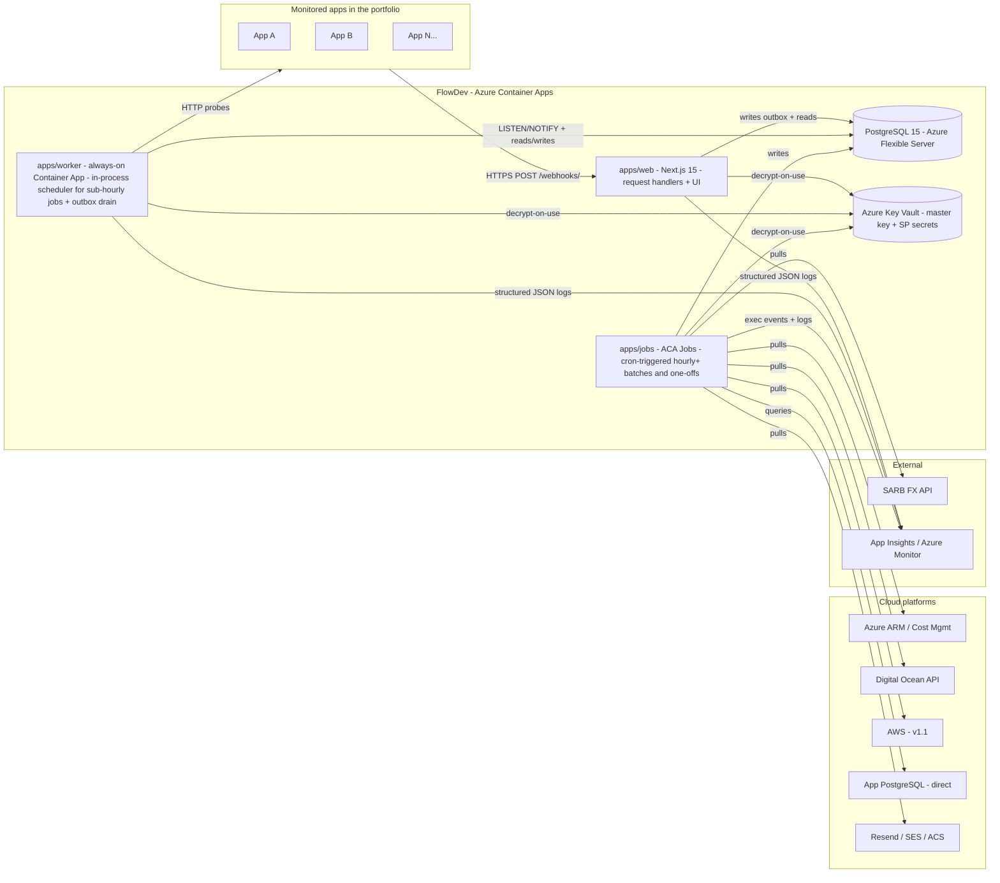

# FlowDev — Architecture Decisions

This document resolves the architect-pending items from PRD §14 (Open Questions & PM Decisions) and pins the structural decisions that downstream agents (dev, ops, tech-writer) will implement against.

Scope is deliberately narrow: it covers the seven items in the architect's brief from Don (2026-04-28). Sections that the PRD already settled are noted and not relitigated. Companion artefacts:

- **Webhook contract spec:** [`webhook-contract-v1.md`](./webhook-contract-v1.md) — versioned, sender-facing, derived from §14.3.

---

## 1. System overview

FlowDev runs as a single Next.js application **plus** an always-on worker container, with batch operations performed by Azure Container Apps Jobs. All compute lives in the same Azure tenant as FlowDesk; the database is shared infrastructure (separate database, same Flexible Server class).



### Monorepo shape

```
apps/
  web/          # Next.js 15 (App Router) — UI + API routes + webhook receiver
  worker/       # Always-on ACA Container App — scheduler + outbox drain
  jobs/         # Entrypoints invoked by ACA Jobs — one file per scheduled batch
packages/
  connectors/   # Connector interface + per-platform implementations
  db/           # Prisma client + schema
  shared/       # Types, Zod schemas, crypto helpers, FX helpers, logger
```

`apps/web`, `apps/worker`, and `apps/jobs` all consume `packages/connectors/*` against the same TypeScript entrypoint, satisfying the PRD invariant that connector behaviour is identical across in-process (dev) and scheduled execution.

---

## 2. Background worker — §14.1

**Decision:** Hybrid ACA-native runner — an always-on Container App (`apps/worker`) for sub-hourly scheduling, plus ACA Jobs (cron-triggered) for hourly-and-longer batches and one-offs. **No Redis, no BullMQ, no Functions.**

### Why this and not pure ACA Jobs (PM default)

Validated against the three PM acceptance criteria:

| AC | Verdict | Notes |
|---|---|---|
| AC1 — Observability parity vs. queue-based | ✅ | ACA Jobs and Container App executions both emit to Azure Monitor; "no successful run in N minutes" alerts give missed-cadence detection. Equal to BullMQ without the dashboard. |
| AC2 — Cold-start within polling SLA | ⚠️ Fails for 60s probe | Cron-triggered ACA Jobs cold-start at 3–10s = 5–17% of cadence; risks NFR-R3 (±10s p95 probe accuracy). Cron-triggered Jobs cannot pin a warm replica. |
| AC3 — Headroom for v1.1 connector count | ✅ | Independent jobs, max parallelism 100 per Job, ample room for 200 connectors at v1.1. |

AC2 is the deciding factor. Putting the 60s HTTP probe inside an always-on Container App eliminates cold-start at trivial extra cost (one min-replica container running ~24/7). The trade is one additional component (the worker) for predictable probe timing and cleaner outbox draining.

**Tripwire criteria (per PRD §14.1):** none tripped — connectors are independent (no chained job graph), no sub-minute cadence in v1, peak coordination is bounded by app count (~50 in v1, 200 at v1.1) which sits below the 50-concurrent-coordinated threshold once probes are spread across a 60s window.

**Re-evaluation triggers (escalate to BullMQ + Redis if any):**
- `apps/worker` event-loop saturation (>80% CPU sustained 5min) at v1 scale.
- Any v1.1 connector requires sub-30s cadence.
- Connector chaining requirements emerge (e.g. collect → transform → alert as ordered steps with shared state).

### What runs where

**`apps/worker` (always-on Container App, min replicas = 1):**

| Schedule | Workload |
|---|---|
| 60s | HTTP uptime probes for every active app |
| 5s | Webhook outbox drain (`webhook_events_raw` → typed event tables) |
| On Postgres `LISTEN` | Schedule reload on app/connector mutation |

The in-process scheduler is `node-cron` (lightweight, no external dependencies). Schedule state is read from DB on startup and refreshed on `pg_notify('flowdev_schedule_changed', ...)` triggered by mutations to `apps`/`connectors` tables. Fallback is a 60s reload poll, in case `LISTEN` connection drops.

**`apps/jobs` (ACA Jobs, cron-triggered, all in SAST):**

| Cron | Workload | Tolerance |
|---|---|---|
| `5 * * * *` | Hourly aggregate roll-up (prior hour) | Late-arriving data tolerated up to 5min |
| `30 2 * * *` | Daily aggregate roll-up (prior day from hourly) | Runs after hourly settles |
| `0 2 * * *` | Retention prune (raw + hourly) | 10k-row batches; ≤30min budget |
| `*/15 * * * *` | Cost-data pull (per-platform connector) | Tolerates ~12h source lag |
| `0 1 * * *` | Resource snapshot (file/blob/db sizes) | Daily |
| `0 8 * * *` | SARB FX-rate pull | After SARB publishes ZAR/USD |
| `0 * * * *` | DEK re-wrap sweep (post-rotation only; idle otherwise) | Background |

One-off Jobs (manual trigger): on-demand connector re-collection, credential rotation, master-key rotation re-wrap.

### Job semantics

- One execution = one `(app_id, connector_id)` run. No cross-connector state within a job.
- **Retry budget (matches NFR-R4):** initial 30s backoff, factor 2, max 30min, max 5 attempts. HMAC failures and 401/403 from sources do **not** count toward the failure threshold (excluded per PRD §14.3 amendment).
- **Failure-state machine (FR13/FR14a):** `healthy` → `degraded` (1–4 consecutive failures) → `failing` (≥5 consecutive OR no success in last 30min). Exposed on App detail UI.
- **Concurrency control:** per-`(app_id, connector_id)` advisory lock via `pg_try_advisory_lock(hashtext(app_id || ':' || connector_id))` to prevent overlap if a previous run is still active when the next tick fires.

### Observability hooks

- All three apps log JSON to stdout with `correlation_id`, `app_id`, `connector_id`, `connector_type`, `duration_ms`, `outcome`. Azure Container Apps forwards stdout to App Insights.
- Per-connector Azure Monitor alert: "no successful run in 3× cadence" → page on-call.
- Worker liveness: `apps/worker` exposes `/healthz` (HTTP 200 if scheduler tick has fired in last 90s). Container App health probe pinned to it.

---

## 3. Time-series storage — §14.2

**Decision:** Defer TimescaleDB to v2 (PM-decided). v1 ships on plain PostgreSQL 15 with explicit aggregate tables and rolling roll-ups.

### Tables and indexes

| Table | Retention | Indexes |
|---|---|---|
| `health_check_results` | 90d (raw) | `BRIN(recorded_at)`, `BTREE(app_id, recorded_at DESC)` |
| `metric_snapshots` | 90d (raw) | `BRIN(recorded_at)`, `BTREE(app_id, metric_id, recorded_at DESC)` |
| `webhook_events_raw` | 90d (raw, also acts as outbox) | `BTREE(app_id, received_at DESC)`, partial `WHERE processed_at IS NULL` |
| `metric_hourly_aggregates` | 365d | `BTREE(app_id, metric_id, bucket_start DESC)` |
| `metric_daily_aggregates` | indefinite | `BTREE(app_id, metric_id, bucket_start DESC)` |

Aggregate rows store `(count, min, max, avg, p50, p95, sum)`. p50/p95 computed via `percentile_cont` over the hour bucket; cheap at hourly cadence, doesn't need t-digest yet at v1 scale.

BRIN indexes on `recorded_at` give cheap time-range scans on append-only tables — close enough to TimescaleDB chunk pruning for v1's data volume (~78M rows over 90d per PRD).

### Re-evaluation instrumentation (NFR-SC4)

The worker and web both emit `query_duration_ms` with `query_name` to App Insights for any query labelled time-series-sensitive (raw probe scans, dashboard queries). Alert: **p95 of `raw-table-query` > 500ms over 1h window**. Tripping this is the trigger for the v2 TimescaleDB call per PRD §14.2.

### v1.1 portability

TimescaleDB extension is supported on both Azure Flexible Server PG and AWS RDS PG. Migration path is a per-table `CREATE EXTENSION timescaledb` + `SELECT create_hypertable(...)` — no application code changes.

---

## 4. Webhook contract — §14.3

**Decision:** The full contract is published as a separate versioned artefact:

> **[`webhook-contract-v1.md`](./webhook-contract-v1.md)** — sender-facing, includes Sender's Guide and worked HMAC fixture.

Architectural points pinned here that the spec relies on:

### Receiver design (meets the 50ms p95 SLO)

The `/webhooks/<app-token>` route handler does only:

1. Read `app-token` → resolve `app_id` from `apps.webhook_token` (indexed; cached in process).
2. Validate `Content-Length ≤ 16KB`; reject 413 if larger.
3. Validate `X-FlowDev-Webhook-Version` header.
4. Read raw body as bytes (no JSON parse yet).
5. Compute `HMAC-SHA256(secret, "<version>.<timestamp>.<raw_body>")` using the per-app secret (decrypted on first use, cached in-process for 60s); compare in constant time.
6. Parse JSON; validate `|now − payload.timestamp| ≤ 5min`.
7. Idempotency check: `INSERT INTO webhook_events_raw (event_id, app_id, ...) ON CONFLICT (event_id, app_id) DO NOTHING`.
8. Return 202.

Everything typed-event-shaped happens out-of-band on the worker draining `webhook_events_raw`. The receiver path never touches `activity_events`, `integration_calls`, or `custom_metric_events` directly — they are written by the worker.

### Auth boundary

The `/webhooks/*` route group is excluded from Auth.js middleware. No session, no CSRF — HMAC + timestamp is the entire authentication. Wrapping these routes in `auth()` is a configuration error.

### Per-app secret storage

Secret is generated server-side at app registration; stored in `apps.webhook_secret_encrypted` using the envelope encryption pattern (see §7). Plaintext is shown to the registering admin **once**, on the registration confirmation screen. There is no API to retrieve plaintext after that point — rotation generates a new secret and shows that one once.

### Diagnostic view

`/apps/[id]/webhook-deliveries` (ADMIN-only) shows last 50 deliveries from `webhook_events_raw` joined with the receiver's audit row: `(received_at, status_code, hmac_result, idempotency_outcome, body_size, error?)`. Reduces sender-side debugging support load (PRD §14.3).

---

## 5. FX rate — §14.4

**Decision:** SARB daily rate (PM-decided). Implementation:

- **Schedule:** ACA Job at `0 8 * * *` SAST (after SARB publishes the day's blended rate).
- **Endpoint:** SARB Statistical API public endpoint for daily ZAR/USD. No auth. (Exact endpoint URL pinned in `packages/shared/fx/sarb.ts` at implementation time; if SARB changes endpoint format, that file is the single point of change.)
- **Storage:** `fx_rates(currency_pair, rate_date, rate_decimal, source, fetched_at, is_stale)`, PK `(currency_pair, rate_date)`.
- **Snapshot semantics (NFR-D4):** every `cost_records` row captures `(fx_rate, fx_source, fx_rate_date, source_currency, source_amount)` at collection time. Historical reports use the rate captured at snapshot time, never today's rate.
- **Stale handling:** if SARB unreachable >24h, the snapshot stores the most recent successful rate with `is_stale: true`; UI surfaces a "Rate stale since YYYY-MM-DD" badge wherever a stale-rate-derived value is shown.
- **Fallback:** if SARB API reliability < 99% over the 60-day evaluation window (per PRD §14.4), swap to a commercial feed (e.g. exchangerate.host) — single-file change in `packages/shared/fx/`.
- **No SDK** — `fetch` + Zod parse.

UI display: cost-in-ZAR cells render `R 1,234.56` with a muted-foreground sub-label `(USD 67.89 · SARB 2026-04-28)` per Style Guide §FlowDev additions.

---

## 6. Per-app credential scoping — §14.6

**Decision:** Option (b) — class-scoped service principals + Azure RBAC for v1, **conditional on**: (i) RBAC scope is resource-group level minimum, (ii) org policy does not require per-app SP rotation, (iii) future security owner reviews and signs.

This is a PM-proxy decision; Don is acting as security proxy until that role is staffed. The decision is reversible at the 60-day gate.

### Typed credential matrix

"Per-app credential isolation" means different things for different connector types. The PRD intent (blast-radius isolation + independent rotation) is preserved by the matrix below — not by literal per-app duplication of every credential.

| Connector type | Credential model | Per-app? | Encrypted at rest |
|---|---|---|---|
| Azure ARM / Cost Mgmt | Class-scoped SP (e.g. `flowdev-prod-readonly-metrics`); per-app data isolation via RBAC at resource-group scope | Shared SP, per-app RBAC | Yes (SP secret) |
| AWS (v1.1) | Per-app IAM role assumed via STS; FlowDev's worker holds a single AWS identity that assumes the per-app role at use | Per app | n/a (role assumption uses temp credentials) |
| Digital Ocean | Per-team API token (we don't have RBAC granularity here) | Per team/account | Yes |
| PostgreSQL direct | Per-app DB user, read-only, scoped to monitoring tables | **Per app — mandatory** | Yes |
| Resend | Per-project API key | Per app | Yes |
| AWS SES | Per-app IAM role (v1.1) or per-account access keys | Per app | Yes (when keys; n/a when role) |
| Azure Communication Services | Per-resource connection string or Managed Identity | Per app | Yes (when connection string) |
| HTTP probe | No credential | n/a | n/a |
| Webhook receiver | HMAC secret | **Per app — mandatory** | Yes |

> **Note:** No portfolio app uses SendGrid for outbound email. The portfolio's email providers are Resend, AWS SES, and Azure Communication Services (FlowDesk's SendGrid usage is inbound-parse only and is not portfolio-wide).

### Architect deliverables (per PRD)

- **Rotation cadence:** 90 days for SP secrets and API tokens; manual approval in v1, automated in v1.1.
- **Revocation behaviour:** on `apps.lifecycle_status = 'decommissioned'` or hard-delete (FR4), all owned credentials are destroyed within 24h via the nightly retention prune Job; RBAC entries removed in the same transaction (Azure-side cleanup is best-effort with retry-until-success).
- **Onboarding-time impact:** ~3 minutes added per app for RG-scope RBAC assignment (vs. ~15 minutes for full per-app SP creation under option (a)). Quantified against current FlowDesk app-registration baseline (~30s).
- **Tooling:** v1 ships `scripts/rotate-credentials.ts` and `scripts/revoke-credentials.ts` for manual operator use; full automation tracked as a v1.1 follow-up.

### v1.1 portability note

AWS equivalent of the Azure SP+RBAC pattern is per-app IAM role assumed via STS from a single FlowDev IAM principal. The connector abstraction in `packages/connectors` exposes a `credentialResolver(connector)` hook so the same connector code asks for "the credential" without knowing whether that resolves to an SP secret or an STS-assumed role.

---

## 7. Encryption-at-rest pattern

**Pattern:** Envelope encryption using a Key-Vault-managed master key.

### Why envelope (not direct KV encrypt/decrypt)

KV `encrypt`/`decrypt` operations are rate-limited (~2000 req/sec per vault) and add 5–20ms per call. Using KV to wrap per-credential DEKs means we hit KV once per credential ever (at write time and at first decrypt per process), not on every connector run. App-level cache holds unwrapped DEKs in memory for the lifetime of the worker process.

### Master key

- Azure Key Vault key `flowdev-creds-mk` (RSA-4096, KV-managed lifecycle, soft-delete + purge protection on).
- Versioned in KV. Rotation creates a new version; old version retained until re-wrap sweep completes.
- Both `apps/web` and `apps/worker` (and Job containers) authenticate to KV via Azure Managed Identity. **No KV credentials in app config.**

### Per-credential write

```ts
// Pseudocode — see packages/shared/crypto/envelope.ts at impl time
const dek = crypto.randomBytes(32);                                    // 256-bit DEK
const iv  = crypto.randomBytes(12);                                    // 96-bit IV (GCM)
const cipher = crypto.createCipheriv('aes-256-gcm', dek, iv);
const ciphertext = Buffer.concat([cipher.update(plaintext), cipher.final()]);
const authTag = cipher.getAuthTag();
const wrappedDek = await kv.wrapKey('flowdev-creds-mk', 'RSA-OAEP-256', dek);
dek.fill(0);                                                           // zero immediately
return {
  wrapped_dek: wrappedDek.result,                                      // bytea
  ciphertext,                                                          // bytea
  iv,                                                                  // bytea
  auth_tag: authTag,                                                   // bytea
  kv_key_version: wrappedDek.keyId.split('/').pop(),                   // string
};
```

### Per-credential read (decrypt-on-use)

```ts
async function useCredential<T>(credentialId: string, fn: (plaintext: Buffer) => Promise<T>) {
  const row = await db.connectorCredential.findUniqueOrThrow({ where: { id: credentialId } });
  const dek = await kv.unwrapKey(`flowdev-creds-mk/${row.kv_key_version}`, 'RSA-OAEP-256', row.wrapped_dek);
  const decipher = crypto.createDecipheriv('aes-256-gcm', dek.result, row.iv);
  decipher.setAuthTag(row.auth_tag);
  const plaintext = Buffer.concat([decipher.update(row.ciphertext), decipher.final()]);
  dek.result.fill(0);
  await audit('credential.decrypt', { credentialId, app_id: row.app_id, kv_key_version: row.kv_key_version });
  try {
    return await fn(plaintext);
  } finally {
    plaintext.fill(0);
  }
}
```

Connectors **must** use `useCredential()`; direct `prisma.connectorCredential.findUnique()` calls are linted against. The pattern enforces the "decrypted only in-process at moment of use" mandate.

### Master key rotation

- Operator triggers rotation via KV (creates new key version).
- Manual ACA Job (`re-wrap-deks`) iterates all `connector_credentials`, unwraps with old version, re-wraps with new version, updates `kv_key_version` column. Idempotent — re-runnable.
- Old key version retained in KV (disabled, not deleted) for 30 days after sweep completes, in case rollback is required.

### Audit

Every wrap, unwrap, and master-key version transition is appended to `audit_logs` with `(actor, app_id?, connector_id?, kv_key_version, op, ts)`. This is the same `audit_logs` table FlowDev uses for app/connector/credential mutations (FR50–FR54), unified for ADMIN audit visibility.

---

## 8. Retention defaults & jobs — §14.7

**Decision:** PM-confirmed defaults — raw 90d, hourly aggregates 365d, daily aggregates indefinite (NFR-D1). Per-app override allowed via `apps.retention_overrides` jsonb (NFR-D2), **only to tighten** the default — never extend. Schema-validated on write.

### Prune Job

- Schedule: ACA Job at `0 2 * * *` SAST.
- Per app, per retention-controlled table:
  ```sql
  DELETE FROM <table>
  WHERE app_id = $1
    AND recorded_at < now() - INTERVAL '<effective_retention> days'
  LIMIT 10000;
  -- repeat until rowcount = 0 or 30min budget exhausted
  ```
- Batched 10k rows to avoid long locks on the time-series tables.
- Logs `(table, app_id, rows_deleted, duration_ms)` per batch.

### Aggregate roll-up Jobs

- Hourly Job at `5 * * * *` computes prior hour's aggregates from raw.
- Daily Job at `30 2 * * *` computes prior day's aggregates from hourly (cheaper than rescanning raw).
- Idempotent: `INSERT ... ON CONFLICT (app_id, metric_id, bucket_start) DO UPDATE` so re-runs converge.

### Liveness tripwire

If prune Job logs zero rows deleted across all apps for **two consecutive nights**, alert ops. This catches stuck Jobs early — likely caused by long-held locks, schema drift, or a Job runner failing silently.

### 60-day re-eval gate

Per PRD, the storage growth at 60 days post-launch is reviewed against the defaults; tightening is the expected adjustment if growth exceeds projection.

---

## 9. Data model — Prisma schema sketch for new entities

Inherits Auth.js + User/Role/Account/Session models from FlowDesk. New entities below; full Prisma schema authored at implementation time, but the shapes and key fields are pinned here.

**FlowDev extensions to the inherited Auth.js `User` model:** `passwordHash` (bcrypt; only populated when the credentials provider is in use), `status` (enum `INVITED | ACTIVE | REMOVED`, default `INVITED` until first sign-in flips to `ACTIVE`), `removedAt` (nullable timestamp set when ADMIN soft-deletes a user). These are minor extensions to the inherited model and are added via Prisma's `extend` semantics in the FlowDev schema file.

```prisma
// FlowDev-specific models. Keep alongside FlowDesk-inherited User/Role/Account/Session.

enum LifecycleStatus { ACTIVE DECOMMISSIONED }
enum HealthState     { UP DEGRADED DOWN UNKNOWN }
enum FailureState    { HEALTHY DEGRADED FAILING }
enum UserStatus      { INVITED ACTIVE REMOVED }
enum ConnectorType   {
  HTTP_PROBE
  AZURE_ARM
  AZURE_COST_MGMT
  AZURE_PG_METRICS
  AZURE_BLOB
  AZURE_COMMUNICATION_EMAIL
  DIGITALOCEAN
  POSTGRES_DIRECT
  RESEND
  AWS_SES        // v1.1
  AWS_CLOUDWATCH // v1.1
  AWS_COST_EXPLORER // v1.1
  AWS_RDS        // v1.1
  AWS_S3         // v1.1
  WEBHOOK_RECEIVER  // virtual — webhook receiver is per-app
}

model App {
  id                  String           @id @default(uuid())
  name                String
  description         String?
  ownerId             String
  environment         String           // dev | staging | prod
  hostingPlatform     String           // azure | digitalocean | aws | other
  primaryUrl          String
  techStack           Json             // free-form
  tags                String[]
  lifecycleStatus     LifecycleStatus  @default(ACTIVE)
  webhookToken        String           @unique // 24-char base32, opaque routing token
  webhookSecretEnc    Bytes            // ciphertext
  webhookSecretDek    Bytes            // wrapped DEK
  webhookSecretIv     Bytes
  webhookSecretAuth   Bytes
  webhookSecretKvVer  String
  retentionOverrides  Json?            // { rawDays?: 1..90, hourlyDays?: 1..365 }
  sourceRepoUrl       String?
  runbookUrl          String?
  createdAt           DateTime         @default(now())
  updatedAt           DateTime         @updatedAt
  connectors          Connector[]
  alertRules          AlertRule[]
  @@index([lifecycleStatus])
}

model Connector {
  id              String          @id @default(uuid())
  appId           String
  app             App             @relation(fields: [appId], references: [id], onDelete: Cascade)
  type            ConnectorType
  name            String
  config          Json            // type-specific config (URL, region, RG, etc.)
  scheduleCron    String          // node-cron-compatible expr; null for webhook receiver
  credentialId    String?
  credential      ConnectorCredential? @relation(fields: [credentialId], references: [id])
  failureState    FailureState    @default(HEALTHY)
  consecutiveFailures Int         @default(0)
  lastSuccessAt   DateTime?
  lastFailureAt   DateTime?
  lastError       String?
  createdAt       DateTime        @default(now())
  updatedAt       DateTime        @updatedAt
  @@index([appId, type])
  @@index([failureState])
}

model ConnectorCredential {
  id            String   @id @default(uuid())
  appId         String?  // nullable for class-scoped SPs shared across apps
  type          ConnectorType
  name          String   // e.g. "flowdev-prod-readonly-metrics"
  ciphertext    Bytes
  wrappedDek    Bytes
  iv            Bytes
  authTag       Bytes
  kvKeyVersion  String
  lastRotatedAt DateTime
  createdAt     DateTime @default(now())
  connectors    Connector[]
  @@index([appId, type])
}

model HealthCheckResult {
  id           BigInt   @id @default(autoincrement())
  appId        String
  connectorId  String
  recordedAt   DateTime
  statusCode   Int?
  latencyMs    Int?
  success      Boolean
  state        HealthState
  errorMessage String?
  @@index([appId, recordedAt(sort: Desc)])
  // BRIN(recordedAt) added via migration SQL
}

model MetricSnapshot {
  id          BigInt   @id @default(autoincrement())
  appId       String
  connectorId String
  metricId    String   // e.g. "azure.containerapp.cpu_percent"
  recordedAt  DateTime
  value       Decimal  @db.Decimal(20, 6)
  unit        String?
  dimensions  Json?
  @@index([appId, metricId, recordedAt(sort: Desc)])
  // BRIN(recordedAt) added via migration SQL
}

model MetricHourlyAggregate {
  appId       String
  metricId    String
  bucketStart DateTime
  count       BigInt
  min         Decimal  @db.Decimal(20, 6)
  max         Decimal  @db.Decimal(20, 6)
  avg         Decimal  @db.Decimal(20, 6)
  p50         Decimal  @db.Decimal(20, 6)
  p95         Decimal  @db.Decimal(20, 6)
  sum         Decimal  @db.Decimal(20, 6)
  @@id([appId, metricId, bucketStart])
  @@index([appId, metricId, bucketStart(sort: Desc)])
}

model MetricDailyAggregate {
  appId       String
  metricId    String
  bucketStart DateTime
  count       BigInt
  min         Decimal  @db.Decimal(20, 6)
  max         Decimal  @db.Decimal(20, 6)
  avg         Decimal  @db.Decimal(20, 6)
  p50         Decimal  @db.Decimal(20, 6)
  p95         Decimal  @db.Decimal(20, 6)
  sum         Decimal  @db.Decimal(20, 6)
  @@id([appId, metricId, bucketStart])
  @@index([appId, metricId, bucketStart(sort: Desc)])
}

model CostRecord {
  id              BigInt   @id @default(autoincrement())
  appId           String
  connectorId     String
  periodStart     DateTime
  periodEnd       DateTime
  serviceLine     String   // e.g. "compute" | "storage" | "egress"
  sourceAmount    Decimal  @db.Decimal(20, 6)
  sourceCurrency  String   // ISO 4217
  zarAmount       Decimal  @db.Decimal(20, 6)
  fxRate          Decimal  @db.Decimal(20, 8)
  fxSource        String   // "SARB" v1
  fxRateDate      DateTime @db.Date
  isStale         Boolean  @default(false)
  collectedAt     DateTime @default(now())
  @@index([appId, periodStart(sort: Desc)])
  @@index([appId, serviceLine, periodStart(sort: Desc)])
}

model FxRate {
  currencyPair String   // e.g. "ZAR/USD"
  rateDate     DateTime @db.Date
  rateDecimal  Decimal  @db.Decimal(20, 8)
  source       String   // "SARB"
  fetchedAt    DateTime @default(now())
  isStale      Boolean  @default(false)
  @@id([currencyPair, rateDate])
}

model WebhookEventRaw {
  id          BigInt   @id @default(autoincrement())
  eventId     String   // sender-supplied UUID v4
  appId       String
  receivedAt  DateTime @default(now())
  rawBody     Bytes
  headers     Json
  bodySize    Int
  hmacResult  String   // "valid" | "invalid"
  idempotencyOutcome String // "first" | "replay"
  statusCode  Int
  processedAt DateTime?
  processError String?
  @@unique([eventId, appId])  // idempotency key
  @@index([appId, receivedAt(sort: Desc)])
  @@index([processedAt]) // partial index WHERE processedAt IS NULL via migration SQL
}

model ActivityEvent {
  id           BigInt   @id @default(autoincrement())
  appId        String
  occurredAt   DateTime
  userId       String   // PII — masked in default UI
  userEmailHash String?
  ip           String?
  userAgent    String?
  success      Boolean
  @@index([appId, occurredAt(sort: Desc)])
}

model IntegrationCallEvent {
  id           BigInt   @id @default(autoincrement())
  appId        String
  occurredAt   DateTime
  integration  String
  endpoint     String
  latencyMs    Int
  success      Boolean
  statusCode   Int?
  error        String?
  @@index([appId, integration, occurredAt(sort: Desc)])
}

model CustomMetricEvent {
  id          BigInt   @id @default(autoincrement())
  appId       String
  occurredAt  DateTime
  metric      String
  value       Decimal  @db.Decimal(20, 6)
  unit        String?
  dimensions  Json?
  @@index([appId, metric, occurredAt(sort: Desc)])
}

model ResourceSnapshot {
  id          BigInt   @id @default(autoincrement())
  appId       String
  connectorId String
  recordedAt  DateTime
  resourceType String  // "blob_container" | "db_table" | "db_total"
  resourceId   String  // container name, table name, etc.
  countValue   BigInt?
  byteSize     BigInt?
  @@index([appId, resourceType, recordedAt(sort: Desc)])
}

model EmailEvent {
  id          BigInt   @id @default(autoincrement())
  appId       String
  connectorId String
  occurredAt  DateTime
  provider    String   // "resend" | "ses" | "acs"
  eventType   String   // "sent" | "delivered" | "bounced" | "complained"
  recipientHash String // masked PII
  messageId   String?
  reason      String?
  @@index([appId, occurredAt(sort: Desc)])
}

model AlertRule {
  id          String   @id @default(uuid())
  appId       String?  // null = portfolio-wide
  app         App?     @relation(fields: [appId], references: [id], onDelete: Cascade)
  name        String
  metric      String   // identifier of the metric/aggregate to evaluate
  operator    String   // ">" | "<" | ">=" | "<=" | "=="
  threshold   Decimal  @db.Decimal(20, 6)
  window      String   // "1h" | "24h" | etc.
  channels    Json     // [{ type: "email", target: "..." }, { type: "in_app" }]
  enabled     Boolean  @default(true)
  createdAt   DateTime @default(now())
  updatedAt   DateTime @updatedAt
  @@index([appId, enabled])
}

model AlertEvent {
  id            BigInt   @id @default(autoincrement())
  alertRuleId   String
  appId         String?
  state         String   // "firing" | "acknowledged" | "resolved"
  firedAt       DateTime
  acknowledgedAt DateTime?
  acknowledgedBy String?
  resolvedAt    DateTime?
  observedValue Decimal  @db.Decimal(20, 6)
  context       Json?
  @@index([alertRuleId, firedAt(sort: Desc)])
  @@index([state, firedAt(sort: Desc)])
}

model AuditLog {
  id          BigInt   @id @default(autoincrement())
  occurredAt  DateTime @default(now())
  actorId     String?
  appId       String?
  connectorId String?
  credentialId String?
  op          String   // "app.create" | "credential.decrypt" | "alert.acknowledge" | etc.
  kvKeyVersion String?
  context     Json?
  @@index([appId, occurredAt(sort: Desc)])
  @@index([actorId, occurredAt(sort: Desc)])
  @@index([op, occurredAt(sort: Desc)])
}

// Per-app DEVELOPER scoping (FR65). ADMIN/MANAGER bypass this table — they see all apps.
// Stories 1.3 (server-side RBAC), 1.6 (DEVELOPER scope assignment), 8.11 (alert notification scope) read this table.
model UserAppAssignment {
  userId    String
  appId     String
  user      User     @relation(fields: [userId], references: [id], onDelete: Cascade)
  app       App      @relation(fields: [appId], references: [id], onDelete: Cascade)
  createdAt DateTime @default(now())
  @@id([userId, appId])
  @@index([appId])
}

// Generic key/value store for global system flags. v1 use: "developers_see_cost" boolean (FR39).
// Audit-logged on every write via the audit append helper.
model Setting {
  key        String   @id            // e.g. "developers_see_cost"
  value      Json                    // typed value; readers cast via Zod
  updatedAt  DateTime @updatedAt
  updatedBy  String?                 // actor user id
}
```

### `App.failedWebhookAttempts` counter — derivation pattern (FR14a)

The HMAC-failure counter (FR14a / Story 2.14) is **not stored as a column** on `App`. It is derived from `WebhookEventRaw` via the receiver's `hmacResult` column, since the webhook receiver already persists every delivery attempt with its outcome:

```sql
SELECT COUNT(*)
FROM webhook_events_raw
WHERE app_id = $1
  AND hmac_result = 'invalid'
  AND received_at >= now() - interval '24h';
```

This avoids a write-amplification cost on the receiver path (which has a 50ms p95 SLO per NFR-P3) and uses the same indexed `(app_id, received_at)` access path the webhook diagnostic view (Story 2.16) consumes. No schema change required.

### Migration notes (executed as SQL outside Prisma's migration DSL)

- `CREATE INDEX ... USING BRIN (recorded_at)` for raw time-series tables.
- Partial indexes for `WebhookEventRaw.processedAt IS NULL`.
- Postgres `LISTEN/NOTIFY` triggers on `apps`/`connectors` tables to drive worker schedule reload.

---

## 10. Decisions log (architecture phase)

| Date | Decision | Rationale |
|---|---|---|
| 2026-04-28 | §14.1 — Hybrid `apps/worker` (always-on Container App) + ACA Jobs (cron); no Redis | AC2 cold-start fails for 60s probe under pure ACA Jobs; always-on container eliminates it without adding Redis |
| 2026-04-28 | §14.2 — Defer TimescaleDB; ship plain PG + explicit aggregate tables; trigger via NFR-SC4 instrumentation | PM-decided defer; aggregate strategy keeps query budget achievable at v1 scale |
| 2026-04-28 | §14.3 — Webhook contract published as separate versioned artefact `webhook-contract-v1.md`; receiver uses outbox pattern | Spec is sender-facing; outbox keeps receiver inside the 50ms p95 SLO without coupling to typed event tables |
| 2026-04-28 | §14.4 — SARB daily rate, 08:00 SAST cron, snapshot per CostRecord, stale-flag at >24h | PM-decided source; capture-time semantics make historical reports stable |
| 2026-04-28 | §14.6 — Option (b) class-scoped SP + Azure RBAC; typed credential matrix per connector type | PM-leaned (b) conditional on RBAC scope; matrix preserves the per-app isolation principle without mass-cloning shared platform credentials |
| 2026-04-28 | Encryption-at-rest — envelope encryption (AES-256-GCM DEK + KV RSA-OAEP-256 wrap); MI-based KV access; `useCredential()` enforced via lint | Avoids KV rate limits on hot paths; centralises decrypt-on-use; enforces "decrypted only at moment of use" |
| 2026-04-28 | §14.7 — Confirmed defaults; per-app overrides may only tighten; nightly batched prune; 2-night zero-rows tripwire | PM-confirmed; tripwire catches stuck-job class of failures early |
| 2026-04-28 | Email-provider connector matrix — Resend, AWS SES, Azure Communication Services; no SendGrid for outbound | Don confirmed no portfolio app uses SendGrid for outbound; FlowDesk's SendGrid usage is inbound-parse only |
| 2026-04-28 | Corrective pass post implementation-readiness check: added `UserAppAssignment` (DEVELOPER per-app scoping per FR65), `Setting` (generic key/value for global flags like FR39 cost-visibility toggle), `UserStatus` enum + User-model extensions (`passwordHash`, `status`, `removedAt`), and `App.failedWebhookAttempts` derivation pattern from `WebhookEventRaw.hmacResult` | Implementation-readiness check found these entities/extensions referenced in Stories 1.3, 1.6, 1.5, 4.10, 8.11, 2.14 but absent from the §9 sketch; this corrective pass closes the data-model gap before sprint planning |

---

## 11. Open items handed to dev / ops

These are work items that emerge from the decisions above and belong in the sprint planning phase:

- Author `webhook-contract-v1.md` (separate artefact, this turn).
- Pin SARB API endpoint URL and write `packages/shared/fx/sarb.ts`.
- Provision Key Vault key `flowdev-creds-mk` and wire Managed Identity for ACA Container Apps + Jobs.
- Define ACA Jobs cron expressions in IaC (Bicep or Terraform) per §2.
- Author `scripts/rotate-credentials.ts` and `scripts/revoke-credentials.ts`.
- Author SQL migrations for BRIN indexes and `LISTEN/NOTIFY` triggers (Prisma's DSL doesn't cover these).
- Build the lint rule banning direct `prisma.connectorCredential.findUnique()` outside `useCredential()`.
- Wire App Insights query-duration emission for the NFR-SC4 tripwire alert.
- Pin SP class taxonomy with future security owner (e.g. `flowdev-prod-readonly-metrics`, `flowdev-prod-cost-mgmt`, etc.) — six SPs in the initial set, four if AWS lands later.
